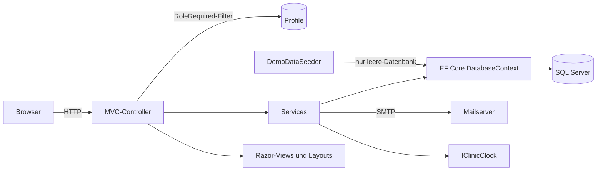
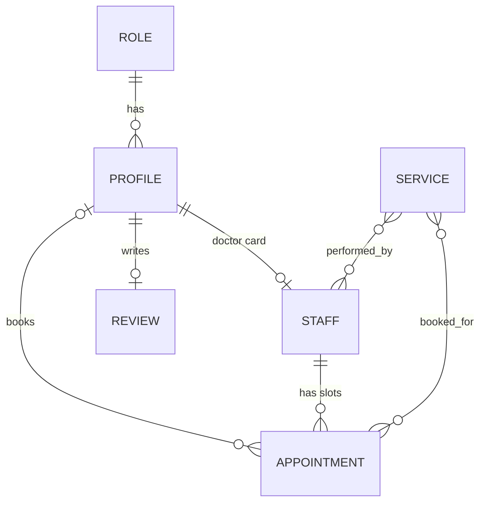

# Aurora Dent

> [🇬🇧 English](README.md) | [🇷🇺 Русский](README.ru.md) | [🇫🇷 Français](README.fr.md) | 🇩🇪 Deutsch

[](https://github.com/DogNellaf/aurora-dent/actions/workflows/ci.yml)


Webanwendung für eine Zahnklinik. Eine öffentliche Website bietet die
Online-Terminbuchung, und getrennte Bereiche bedienen Patienten, Ärzte, Manager
und Administratoren. Die Daten liegen in SQL Server, und eine leere Datenbank
wird beim ersten Start mit einer Demo-Klinik gefüllt. Die Oberfläche steht auf
Russisch, Englisch, Französisch und Deutsch zur Verfügung. Klinik, Ärzte und
Bewertungen sind erfunden, die Fotos stammen von [Unsplash](https://unsplash.com).


## Schnellstart

Docker Compose startet die Anwendung zusammen mit SQL Server und einem Test-Mailserver.

```bash
docker compose up --build
```

Öffnen Sie <http://localhost:8080>. Die Anmeldeseite bietet Ein-Klick-Schaltflächen
für die Demo-Konten, das gemeinsame Passwort lautet `Demo123!`. Jede von der
Anwendung gesendete E-Mail (Terminbestätigungen mit Kalenderdatei, Passwort-Resets)
erscheint unter <http://localhost:8025>.

| Rolle | E-Mail | Umfang |
|---|---|---|
| Patient | `client@clinic.demo` | Termine buchen und absagen, Empfehlungen, eine Bewertung |
| Arzt | `doctor@clinic.demo` | Live-Übersicht des laufenden Termins, Termin verlängern oder beenden, Patientenakten |
| Manager | `manager@clinic.demo` | Moderationswarteschlange für Bewertungen |
| Administrator | `admin@clinic.demo` | Klinikübersicht, Terminplan, Profile, Bewertungen |

Für die Entwicklung auf dem eigenen Rechner genügt es, die Datenbank zu starten
und die Anwendung auszuführen.

```bash
docker compose up -d db
dotnet run
```

Die Anwendung lauscht auf <http://localhost:5000>. Ein fertiges Image wird von
der CI in der GitHub Container Registry veröffentlicht.

```bash
docker run -p 8080:8080 -e ConnectionStrings__DefaultConnection="..." ghcr.io/dognellaf/aurora-dent:latest
```

## Fallstudie

### Problem

Eine kleine Klinik braucht einen einzigen Ort, an dem Patienten freie Zeiten
sehen und ohne Anruf buchen, Ärzte ihren Tag einschließlich des laufenden
Termins steuern, Manager kontrollieren, welche Bewertungen erscheinen, und
Administratoren alles Übrige erledigen. Zwei Patienten dürfen nie denselben
Termin erhalten, und jede Rolle darf nur die Daten sehen, die für ihre Arbeit
nötig sind.

### Lösung

| Rolle | Bereich |
|---|---|
| **Patient** | Kommende Termine und Verlauf mit den Empfehlungen des Arztes, Absage bis 2 Stunden vor dem Termin, Kalenderdatei für jeden Termin, eine Bewertung mit Moderation, eigenes Profil und Passwort |
| **Arzt** | Laufender Termin mit Fortschrittsbalken, Tagesplan, Verlängern oder Beenden mit Begründung, Empfehlungen, Patientenverlauf, Generator für die eigenen freien Termine |
| **Manager** | Wartende und veröffentlichte Bewertungen mit Zähler, Aktionen zum Veröffentlichen und Ausblenden |
| **Administrator** | Zähler und nächste Termine, CRUD und Massenerstellung von Terminen, Profile (anlegen, bearbeiten, sperren, löschen) und Bewertungen, mit Suche und Seitenwechsel in jeder Liste |

Die Buchung läuft in drei Schritten auf einer Seite mit einer optionalen
Leistung, einem nach der Leistung gefilterten Arzt und einer freien Zeit. Freie
Zeiten sind für alle sichtbar, und die Buchung bleibt Patienten vorbehalten.

### Technische Schwerpunkte

- **Ein Termin lässt sich nicht doppelt buchen.** Die Buchung ist ein einziges
  `UPDATE ... WHERE Id = @id AND ClientId = 0` (`ExecuteUpdate`). Von zwei
  gleichzeitigen Anfragen ändert nur eine eine Zeile, die andere erhält die
  Meldung, dass die Zeit gerade vergeben wurde. Integrationstests decken das
  Rennen zwischen zwei Patienten ab.
- **Die Autorisierung liegt an einer einzigen Stelle.** Der Filter
  `[RoleRequired]` ermittelt das angemeldete Profil einmal pro Anfrage, prüft
  die Rolle und meldet Konten ab, die gesperrt oder gelöscht wurden, während das
  Cookie noch gültig war. Anonyme Nutzer werden zur Anmeldeseite geleitet und
  Nutzer mit anderer Rolle zur Seite für verweigerten Zugriff. Tests prüfen jede
  Rolle gegen jeden Bereich.
- **Migrationen und ein Drift-Test.** Das Schema entsteht durch EF-Core-Migrationen,
  die beim Start angewendet werden, und die vier Rollen gehören zum Modell
  (`HasData`), sodass eine frische Datenbank sofort nutzbar ist. Ein Test
  vergleicht das Modell mit dem letzten Migrations-Snapshot und schlägt fehl,
  wenn eine Modelländerung ohne Migration kommt.
- **Regeln, die die Datenbank durchsetzt.** Ein Fremdschlüssel vom Termin zum
  Patienten (ein freier Termin hat keinen Patienten, statt einer magischen
  Null), ein eindeutiger Index auf Arzt und Beginn, eine Bewertung pro Patient,
  exakte `decimal`-Preise. Tests zeigen, dass die Datenbank Verstöße ablehnt,
  die Regeln gelten also auch dann, wenn der Anwendungscode umgangen wird.
- **Zeitzone der Klinik.** Terminzeiten sind die Ortszeit der Klinik.
  `IClinicClock` baut auf `TimeProvider` und einer konfigurierten IANA-Zeitzone
  auf, sodass Container in UTC den Terminplan nicht verschieben, und die Uhr
  lässt sich in Tests ersetzen.
- **Service-Schicht.** Buchung, Terminerzeugung, Profile, Bewertungen,
  Benachrichtigungen und Kalenderexport liegen in Services hinter Schnittstellen.
  Controller übersetzen nur HTTP in Service-Aufrufe und Ergebnisse in Antworten.
- **E-Mail-Ausfälle bleiben begrenzt.** Buchen und Absagen senden E-Mails über
  SMTP (MailKit) mit einem `.ics`-Anhang. Ein ausgefallener Mailserver wird
  protokolliert und ignoriert, was ein Test belegt. Ohne SMTP-Host protokolliert
  der Versender nur.
- **Strukturierte Protokollierung.** Serilog schreibt Ereignisse mit benannten
  Eigenschaften wie Profil- und Termin-IDs, und die Anfrageprotokollierung ist
  aktiv.
- **Idempotente Demo-Daten.** Der Seeder läuft nur auf einer leeren Datenbank
  und baut den Terminplan relativ zum aktuellen Datum auf, einschließlich eines
  laufenden Termins, sodass die Übersicht des Arztes nie leer ist.
- **Konsistentes Löschen.** Das Löschen eines Profils gibt die künftigen Termine
  des Patienten frei und entfernt die Bewertungen. Ein freigegebener Termin
  behält nichts vom früheren Besuch, keine Empfehlung und keine Leistungen. Ein
  Arzt mit Patienten kann nicht gelöscht werden, weil die Fremdschlüssel die
  Termine anderer Personen entfernen würden, daher wird das Profil stattdessen
  gesperrt. Ein Arzt ohne Patienten wird mit Karte und Terminplan entfernt. Beim
  Anlegen eines Arztes entsteht auch die Karte, sodass der Bereich sofort
  funktioniert.
- **Betrieb eingebaut.** Ein Endpunkt `/health` prüft die Datenbank, und der
  Docker-Health-Check nutzt ihn. Jede Antwort trägt Sicherheits-Header (Content
  Security Policy ohne Inline-Skripte, `X-Frame-Options`, `nosniff`, Referrer-
  und Permissions-Richtlinien). Versionierte statische Dateien werden lange
  zwischengespeichert. Datenbankverbindungen werden wiederholt, während der
  Server startet.
- **Vier Sprachen.** Oberfläche, Validierungsmeldungen, E-Mails und
  Kalenderdateien gibt es auf Russisch, Englisch, Französisch und Deutsch, je
  nach Umschalter oder Browsereinstellung. Die Übersetzungstabellen sind
  eingebettete JSON-Dateien, und Tests schlagen bei einer fehlenden Übersetzung,
  einem geänderten Platzhalter oder russischem Text auf einer Seite in einer
  anderen Sprache fehl.
- **Kein Client-Framework.** Ein von Hand geschriebenes CSS-Designsystem mit
  Tokens in einem einzigen Stylesheet, etwa 100 Zeilen reines JS, ein
  SVG-Symbolsprite im Markup und selbst gehostete Schriften. Kyrillisch und
  Buchstaben mit Akzent werden unverändert ausgegeben statt als Entitäten
  `&#x...;`.
- **Barrierearm und responsiv.** Semantisches Markup, sichtbare Fokuszustände,
  Unterstützung für `prefers-reduced-motion`, ein mobiles Menü, Layouts geprüft
  bei 390 px.

### Sicherheit

- Jeder POST trägt ein Antiforgery-Token (`AutoValidateAntiforgeryToken`).
  Abmelden und Buchen laufen nur über POST, sodass weder ein Link noch ein Bild
  eine der Aktionen auslösen kann.
- Gesperrte Konten können sich nicht anmelden und werden bei der nächsten
  Anfrage abgemeldet. Die Sperre ist eine eigene Spalte, sodass das Bearbeiten
  eines Profils die Sperre unberührt lässt.
- Links in E-Mails werden aus der konfigurierten öffentlichen Adresse gebaut,
  sodass ein gefälschter Host-Header einen Reset-Link nicht auf eine andere
  Seite umleiten kann.
- Fünf falsche Passwörter sperren ein Konto für fünfzehn Minuten, und ein
  Passwort-Reset hebt die Sperre auf.
- Reset-Links sind einmalig verwendbar. Das Formular antwortet für bekannte und
  unbekannte Adressen gleich, sodass sich registrierte E-Mail-Adressen nicht
  herausfinden lassen.
- Patienten öffnen und sagen nur eigene Termine ab, alles andere liefert 404.
  Ärzte arbeiten nur mit den ihnen zugewiesenen Terminen.
- Die `returnUrl` nach der Anmeldung wird nur akzeptiert, wenn sie lokal ist.
- Eingaben werden auf dem Server mit Meldungen in der Sprache des Besuchers
  validiert. Profiländerungen binden explizite View-Modelle statt Entitäten.
- Eine Content Security Policy verbietet Inline-Skripte und fremden Code. Ein
  Test durchsucht die Seiten und schlägt bei jedem Inline-Skript oder
  `onclick` fehl.
- Passwörter werden von ASP.NET Core Identity gehasht. Demo-Konten teilen ein
  veröffentlichtes Passwort, daher sind Demo-Daten standardmäßig aus und werden
  nur durch die Entwicklungseinstellungen und die Compose-Datei eingeschaltet.
- Die Sperrmeldung erscheint erst nach dem richtigen Passwort, ein gesperrtes
  Konto gilt auf öffentlichen Seiten als abgemeldet, und ein gesperrter Arzt
  verschwindet von der Website und lässt sich nicht mehr buchen.
- `X-Forwarded-*`-Header werden nur aus konfigurierten Proxy-Netzen geglaubt
  (standardmäßig private Bereiche). Ärzte öffnen die Akten der ihnen
  zugewiesenen Patienten, nicht die aller anderen.

### Architektur



Datenmodell.



| Modul | Aufgabe |
|---|---|
| `Controllers/HomeController.cs` | Öffentliche Seiten, Terminplan und atomare Buchung |
| `Controllers/{Auth,Account,Client,Doctor,Manager,Admin}Controller.cs` | Anmeldung und Passwort-Reset, eigenes Profil und je ein durch `[RoleRequired]` geschützter Controller pro Rolle |
| `Services/BookingService.cs` | Atomares Buchen und Absagen mit der Absagefrist |
| `Services/ScheduleService.cs` | Daten der Buchungsseite und Massenerstellung von Terminen |
| `Services/ProfileService.cs`, `Services/ReviewService.cs` | Regeln für Profile und Bewertungen mit konsistenter Bereinigung |
| `Services/Notifier.cs`, `Services/Email.cs`, `Services/CalendarExporter.cs` | E-Mails, SMTP-Versand und `.ics`-Dateien |
| `Services/ClinicClock.cs` | Aktuelle Zeit in der Zeitzone der Klinik |
| `Infrastructure/RoleRequiredAttribute.cs` | Authentifizierung, Rollenprüfung und Durchsetzung von Sperren |
| `Infrastructure/SecurityHeaders.cs` | CSP und weitere Sicherheits-Header |
| `Infrastructure/Fmt.cs` | Beträge, Datumsangaben, Dauern und Pluralformen in der Sprache des Besuchers |
| `Localization/` | Sprachliste, eingebettete Übersetzungstabellen und der Localizer für Views, Validierung und E-Mails |
| `Data/DemoDataSeeder.cs` | Demo-Klinik mit Leistungen, Ärzten, Terminplan, Patienten und Bewertungen |
| `Data/Migrations/` | EF-Core-Migrationen |
| `Models/ViewModels/` | An Views übergebene Formen, wodurch Views ohne zusätzliche Abfragen bleiben |
| `Views/Shared/_CabinetLayout.cshtml` | Gemeinsames Layout der vier Bereiche |

## Sprachen

Oberfläche, Validierungsmeldungen und E-Mails gibt es auf Russisch, Englisch,
Französisch und Deutsch. Russisch ist die Ausgangssprache und die
Standardsprache. Die Sprache stammt aus dem Cookie, das der Umschalter in der
oberen Leiste setzt, danach aus dem Header `Accept-Language` des Browsers. Texte
werden anhand ihrer russischen Formulierung in
`Localization/Resources/{en,fr,de}.json` gesucht, sodass ein Text ohne
Übersetzung, zum Beispiel eine von einem Manager eingegebene Leistung,
unverändert angezeigt wird. Datumsangaben, Zahlen, Pluralformen und Dauern
folgen ebenfalls der Sprache.

Eine Sprache hinzuzufügen erfordert drei Schritte. Die Sprache wird in
`Localization/Languages.cs` eingetragen, eine Tabelle
`Localization/Resources/<code>.json` erhält dieselben Schlüssel wie `en.json`,
und `Infrastructure/Fmt.cs` bekommt die Formatierungsregeln, falls die Sprache
sie braucht.

## Screenshots

| Online-Buchung | Patientenbereich |
|---|---|
|  |  |

| Übersicht des Arztes | Übersicht des Administrators |
|---|---|
|  |  |

| Leistungen | Moderation der Bewertungen |
|---|---|
|  |  |

| Terminplan-Generator | Termine des Administrators |
|---|---|
|  |  |

| Startseite mobil | Buchung mobil |
|---|---|
|  |  |

## Konfiguration

Die Einstellungen stammen aus `appsettings.json` oder aus Umgebungsvariablen
wie `ConnectionStrings__DefaultConnection`.

| Schlüssel | Zweck | Standardwert |
|---|---|---|
| `ConnectionStrings:DefaultConnection` | SQL-Server-Verbindungszeichenfolge | `localhost,1433`, Datenbank `dental_clinic`, der Dienst `db` aus `docker-compose.yml` |
| `Seed:DemoData` | Füllt eine leere Datenbank mit Demo-Daten, eingeschaltet in Development und in `docker-compose.yml` | `false` |
| `Bootstrap:AdminEmail`, `Bootstrap:AdminPassword`, `Bootstrap:AdminName` | Legt den ersten Administrator an, wenn noch keiner existiert | leer |
| `Hosting:TrustedProxies` | CIDR-Netze, deren `X-Forwarded-*`-Header geglaubt werden | Loopback und private Bereiche |
| `Hosting:HttpsRedirection` | Leitet HTTP auf HTTPS um, aus, weil TLS meist von einem Proxy beendet wird | `false` |
| `Clinic:TimeZone` | IANA-Zeitzone der Klinik, verwendet für alle Terminzeiten | `Europe/Moscow` |
| `Clinic:PublicUrl` | Öffentliche Adresse der Website, für Links in E-Mails statt des Host-Headers | leer, aus der Anfrage abgeleitet |
| `Clinic:Name`, `Clinic:Address`, `Clinic:Phone` | Angaben in E-Mails und Kalenderdateien | Demo-Klinik |
| `Email:Host`, `Email:Port`, `Email:UseSsl`, `Email:User`, `Email:Password`, `Email:FromAddress` | SMTP-Server, ein leerer Host bedeutet, dass E-Mails nur protokolliert werden | leer |

Ein echter Betrieb lässt die Demo-Daten aus und setzt einmalig
`Bootstrap__AdminEmail` und `Bootstrap__AdminPassword`, was beim Start den
ersten Administrator anlegt. Die Rollen-IDs sind 1 Patient, 2 Administrator,
3 Manager und 4 Arzt.

### Migrationen

Migrationen werden beim Start automatisch angewendet. Eine Datenbank mit Tabellen
ohne Migrationsverlauf stammt aus einer älteren Version der Anwendung, und der
Start bricht mit einer Erklärung ab. Eine solche Datenbank muss gelöscht werden.
Eine neue Migration entsteht mit dem lokalen EF-Werkzeug.

```bash
dotnet tool restore
dotnet ef migrations add AddSomething --project DentalClinic.csproj -o Data/Migrations
```

## Tests

Die Tests benötigen einen SQL Server. Der Dienst `db` aus Compose stellt einen bereit.

```bash
docker compose up -d db
dotnet test
```

Es gibt 242 Tests mit 97 % Zeilenabdeckung. Die meisten sind Integrationstests,
die die gesamte Anwendung auf einer frischen Datenbank starten und echte
HTTP-Anfragen, Cookies und Antiforgery-Tokens verwenden. Sie decken öffentliche
Seiten, die Zugriffskontrolle jeder Rolle, Registrierung, Anmeldung und Sperren,
die Buchung einschließlich des Rennens um einen Termin, das Absagen, die
Terminsteuerung des Arztes, die Bereinigungsregeln des Administrators, die
Moderation von Bewertungen, die Kontosperre, den Passwort-Reset, E-Mails, die
Massenerstellung von Terminen, Suche und Seitenwechsel, Datenbankeinschränkungen,
Sicherheits-Header und den Health-Check ab. Lokalisierungstests prüfen jede Seite
jedes Bereichs in allen Sprachen. Die übrigen sind Tests auf Service-Ebene und
Unit-Tests für die Klinikuhr, den Kalenderexport und die Formatierungshilfen.
Jede Testklasse legt eine eigene Datenbank an und löscht sie anschließend. Ein
anderer Server lässt sich über die Variable `TEST_SQLSERVER_CONNECTION` wählen,
eine Verbindungszeichenfolge ohne Datenbanknamen.

Ein Smoke-Test von Anfang bis Ende geht den echten Nutzerweg per HTTP gegen eine
laufende Instanz durch und umfasst Health, öffentliche Seiten, Anmeldung,
Buchen und Absagen, Kalender-Download, Kontosperre, Seitenwechsel und
Rollentrennung. Ist `SMOKE_MAIL_URL` gesetzt, prüft der Test zusätzlich die
Zustellung der Bestätigungs-E-Mail am Mailserver.

```bash
python3 docker/smoke_test.py http://localhost:8080
```

### CI

[`ci.yml`](.github/workflows/ci.yml) läuft bei jedem Push und Pull Request.

| Job | Aktion |
|---|---|
| **Format und Warnungen** | `dotnet format` gegen `.editorconfig` und ein Release-Build mit Warnungen als Fehlern |
| **Tests mit Abdeckung** | Gesamte Suite gegen einen SQL-Server-Service-Container, einschließlich des Migrations-Drift-Tests, Fehlschlag unter 85 % Zeilenabdeckung, Abdeckung in der Job-Zusammenfassung |
| **Docker** | Baut das Image, startet den Compose-Stack mit dem Test-Mailserver, wartet auf die Health-Checks und führt den Smoke-Test aus |

[`docker-publish.yml`](.github/workflows/docker-publish.yml) schiebt das Image
aus `master` und bei Versions-Tags in die GitHub Container Registry. Dependabot
beobachtet NuGet-Pakete, GitHub Actions und Basis-Images. Die lokalen Prüfungen
stehen in [CONTRIBUTING.md](CONTRIBUTING.md).

## Projektstruktur

```
├── Controllers/           # Öffentliche Website und ein Controller pro Rolle
├── Data/                  # Demo-Daten-Seeder und EF-Core-Migrationen
├── Services/              # Buchung, Terminplan, Profile, Bewertungen, Benachrichtigungen, Uhr
├── Infrastructure/        # [RoleRequired]-Filter, Sicherheits-Header, Seitenwechsel, Formatierung
├── Localization/          # Sprachen und Übersetzungstabellen (en, fr, de)
├── Models/                # EF-Entitäten, DTOs und View-Modelle
├── Views/                 # Razor-Views, Layouts und Partials
├── wwwroot/               # CSS, JS, Schriften und Bilder
├── DentalClinic.Tests/    # xUnit-Integrations- und Unit-Tests
├── docker/smoke_test.py   # Smoke-Test einer laufenden Instanz von Anfang bis Ende
├── docs/screenshots/
├── Dockerfile
├── docker-compose.yml     # Anwendung, SQL Server und ein Test-Mailserver
└── .github/               # CI, Image-Veröffentlichung, Dependabot, PR-Vorlage
```

## Danksagung

Fotos von [Unsplash](https://unsplash.com) unter der Unsplash-Lizenz.
Klinikinterieur von Benyamin Bohlouli, Röntgenbildbesprechung von Jonathan
Borba, Lächeln von Dr Farid Sharifi, Porträts der Ärzte von Siednji Leon, Bruno
Rodrigues und Usman Yousaf. Die Schriften Manrope und Playfair Display (SIL OFL)
über Fontsource.

## Lizenz

[PolyForm Noncommercial 1.0.0](LICENSE). Nutzung, Änderung und Weitergabe sind
für jeden nichtkommerziellen Zweck erlaubt, sofern der Hinweis
`Copyright (c) 2026 DogNellaf` erhalten bleibt. Eine kommerzielle Nutzung
erfordert eine gesonderte Lizenz von [DogNellaf](https://github.com/DogNellaf).
