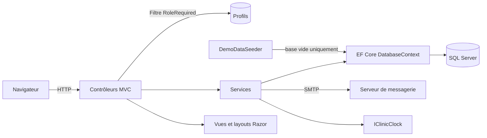
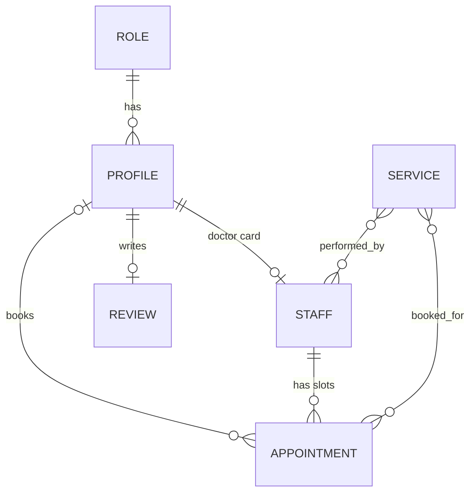

# Aurora Dent

> [🇬🇧 English](README.md) | [🇷🇺 Русский](README.ru.md) | 🇫🇷 Français | [🇩🇪 Deutsch](README.de.md)

[](https://github.com/DogNellaf/aurora-dent/actions/workflows/ci.yml)


Application web pour une clinique dentaire. Un site public propose la prise de
rendez-vous en ligne, et des espaces distincts servent les patients, les
médecins, les gestionnaires et les administrateurs. Les données sont stockées
dans SQL Server, et une base vide est remplie avec une clinique de démonstration
au premier démarrage. L'interface est disponible en russe, en anglais, en
français et en allemand. La clinique, les médecins et les avis sont fictifs, les
photos viennent d'[Unsplash](https://unsplash.com).


## Démarrage rapide

Docker Compose lance l'application avec SQL Server et un serveur de messagerie de test.

```bash
docker compose up --build
```

Ouvrir <http://localhost:8080>. La page de connexion propose des boutons de
connexion en un clic pour les comptes de démonstration, et le mot de passe
commun est `Demo123!`. Chaque e-mail envoyé par l'application (confirmations de
rendez-vous avec fichier de calendrier, réinitialisations de mot de passe)
apparaît sur <http://localhost:8025>.

| Rôle | E-mail | Périmètre |
|---|---|---|
| Patient | `client@clinic.demo` | Réservation et annulation de rendez-vous, recommandations, un avis |
| Médecin | `doctor@clinic.demo` | Tableau de bord du rendez-vous en cours, prolongation ou clôture d'un rendez-vous, dossiers des patients |
| Gestionnaire | `manager@clinic.demo` | File de modération des avis |
| Administrateur | `admin@clinic.demo` | Vue d'ensemble de la clinique, planning, profils, avis |

Pour le développement sur la machine locale, il suffit de démarrer la base de
données et de lancer l'application.

```bash
docker compose up -d db
dotnet run
```

L'application écoute sur <http://localhost:5000>. Une image prête à l'emploi est
publiée par la CI sur GitHub Container Registry.

```bash
docker run -p 8080:8080 -e ConnectionStrings__DefaultConnection="..." ghcr.io/dognellaf/aurora-dent:latest
```

## Étude de cas

### Problème

Une petite clinique a besoin d'un lieu unique où les patients voient les
créneaux libres et réservent sans téléphoner, où les médecins gèrent leur
journée y compris le rendez-vous en cours, où les gestionnaires contrôlent les
avis publiés et où les administrateurs s'occupent du reste. Deux patients ne
doivent jamais obtenir le même créneau, et chaque rôle ne doit voir que les
données nécessaires à son travail.

### Solution

| Rôle | Espace |
|---|---|
| **Patient** | Rendez-vous à venir et historique avec les recommandations du médecin, annulation jusqu'à 2 heures avant le rendez-vous, fichier de calendrier pour chaque rendez-vous, un avis soumis à modération, profil et mot de passe personnels |
| **Médecin** | Rendez-vous en cours avec barre de progression, planning de la journée, prolongation ou clôture avec un motif, recommandations, historique des patients, générateur de ses propres créneaux libres |
| **Gestionnaire** | Avis en attente et publiés avec compteur, actions de publication et de masquage |
| **Administrateur** | Compteurs et prochains rendez-vous, CRUD et création en masse des créneaux, profils (création, modification, blocage, suppression) et avis, avec recherche et pagination dans chaque liste |

La réservation se fait en trois étapes sur une seule page, avec un soin
facultatif, un médecin filtré selon le soin et un créneau libre. Les créneaux
libres sont visibles par tous, et la réservation est réservée aux patients.

### Points forts techniques

- **Un créneau ne peut pas être réservé deux fois.** La réservation est un seul
  `UPDATE ... WHERE Id = @id AND ClientId = 0` (`ExecuteUpdate`). Sur deux
  requêtes simultanées, une seule modifie une ligne, et l'autre reçoit un
  message indiquant que le créneau vient d'être pris. Des tests d'intégration
  couvrent la course entre deux patients.
- **L'autorisation vit à un seul endroit.** Le filtre `[RoleRequired]` résout le
  profil connecté une fois par requête, vérifie le rôle et déconnecte les
  comptes bloqués ou supprimés alors que le cookie était encore valide. Les
  utilisateurs anonymes sont envoyés vers la page de connexion et les
  utilisateurs d'un autre rôle vers la page d'accès refusé. Des tests vérifient
  chaque rôle sur chaque espace.
- **Migrations et test de dérive.** Le schéma est créé par les migrations EF
  Core appliquées au démarrage, et les quatre rôles font partie du modèle
  (`HasData`), si bien qu'une base neuve est utilisable immédiatement. Un test
  compare le modèle avec le dernier instantané de migration et échoue quand une
  modification du modèle arrive sans migration.
- **Règles imposées par la base de données.** Une clé étrangère du rendez-vous
  vers le patient (un créneau libre n'a pas de patient, au lieu d'un zéro
  magique), un index unique sur le médecin et l'heure de début, un avis par
  patient, des prix exacts en `decimal`. Des tests montrent la base refusant les
  violations, si bien que les règles tiennent même quand le code applicatif est
  contourné.
- **Fuseau horaire de la clinique.** Les heures de rendez-vous sont l'heure
  locale de la clinique. `IClinicClock` repose sur `TimeProvider` et sur un
  fuseau IANA configuré, si bien que les conteneurs en UTC ne décalent pas le
  planning, et l'horloge est remplaçable dans les tests.
- **Couche de services.** La réservation, la génération du planning, les
  profils, les avis, les notifications et l'export de calendrier vivent dans des
  services derrière des interfaces. Les contrôleurs traduisent seulement le HTTP
  en appels de services et les résultats en réponses.
- **Les pannes d'e-mail restent contenues.** La réservation et l'annulation
  envoient des e-mails par SMTP (MailKit) avec une pièce jointe `.ics`. Un
  serveur de messagerie en panne est journalisé et ignoré, ce qu'un test
  démontre. Sans hôte SMTP, l'expéditeur se contente de journaliser.
- **Journalisation structurée.** Serilog écrit des événements avec des
  propriétés nommées comme les identifiants de profil et de rendez-vous, et la
  journalisation des requêtes est activée.
- **Données de démonstration idempotentes.** Le seeder ne s'exécute que sur une
  base vide et construit le planning par rapport à la date du jour, y compris un
  rendez-vous en cours, si bien que le tableau de bord du médecin n'est jamais
  vide.
- **Suppressions cohérentes.** La suppression d'un profil libère les créneaux
  futurs du patient et retire les avis. Un créneau libéré ne garde rien de
  l'ancien rendez-vous, ni recommandation ni soins. Un médecin ayant des
  patients ne peut pas être supprimé, car les clés étrangères retireraient les
  rendez-vous d'autres personnes, le profil est donc bloqué à la place. Un
  médecin sans patients est supprimé avec sa fiche et son planning. La création
  d'un médecin crée aussi la fiche, si bien que l'espace fonctionne tout de
  suite.
- **Exploitation intégrée.** Un point de terminaison `/health` vérifie la base
  de données, et le health check Docker s'appuie dessus. Chaque réponse porte
  des en-têtes de sécurité (Content Security Policy sans script en ligne,
  `X-Frame-Options`, `nosniff`, politiques referrer et permissions). Les
  fichiers statiques versionnés sont mis en cache longtemps. Les connexions à
  la base sont retentées pendant le démarrage du serveur.
- **Quatre langues.** L'interface, les messages de validation, les e-mails et
  les fichiers de calendrier existent en russe, en anglais, en français et en
  allemand, au choix avec un sélecteur ou selon le réglage du navigateur. Les
  tables de traduction sont des fichiers JSON embarqués, et des tests échouent
  en cas de traduction manquante, de paramètre modifié ou de texte russe sur une
  page d'une autre langue.
- **Aucun framework côté client.** Un système de design en CSS écrit à la main
  avec des jetons dans une seule feuille de style, environ 100 lignes de JS
  natif, un sprite d'icônes SVG en ligne et des polices hébergées localement.
  Le cyrillique et les lettres latines accentuées sont rendus tels quels au
  lieu d'entités `&#x...;`.
- **Accessible et adaptatif.** Balisage sémantique, états de focus visibles,
  prise en charge de `prefers-reduced-motion`, menu mobile, mises en page
  vérifiées à 390 px.

### Sécurité

- Chaque POST porte un jeton antiforgery (`AutoValidateAntiforgeryToken`). La
  déconnexion et la réservation passent uniquement par POST, si bien qu'un lien
  ou une image ne peut déclencher aucune de ces actions.
- Les comptes bloqués ne peuvent pas se connecter et sont déconnectés à la
  requête suivante. Le blocage est une colonne séparée, si bien que la
  modification d'un profil laisse le blocage intact.
- Les liens des e-mails sont construits à partir de l'adresse publique
  configurée, si bien qu'un en-tête Host falsifié ne peut pas rediriger un lien
  de réinitialisation vers un autre site.
- Cinq mots de passe erronés verrouillent un compte pendant quinze minutes, et
  une réinitialisation du mot de passe lève le verrou.
- Les liens de réinitialisation sont à usage unique. Le formulaire répond de la
  même manière pour les adresses connues et inconnues, si bien que les adresses
  inscrites ne peuvent pas être découvertes.
- Les patients ouvrent et annulent uniquement leurs propres rendez-vous, tout
  le reste renvoie 404. Les médecins travaillent uniquement avec les rendez-vous
  qui leur sont attribués.
- Le `returnUrl` après connexion n'est accepté que s'il est local.
- Les saisies sont validées sur le serveur avec des messages dans la langue du
  visiteur. Les modifications de profil lient des modèles de vue explicites au
  lieu des entités.
- Une Content Security Policy interdit les scripts en ligne et le code tiers.
  Un test parcourt les pages et échoue au moindre script en ligne ou `onclick`.
- Les mots de passe sont hachés par ASP.NET Core Identity. Les comptes de
  démonstration partagent un mot de passe publié, si bien que les données de
  démonstration sont désactivées par défaut et activées uniquement par les
  réglages de développement et le fichier Compose.
- Le message de blocage n'apparaît qu'après le bon mot de passe, un compte
  bloqué est traité comme déconnecté sur les pages publiques, et un médecin
  bloqué disparaît du site et ne peut plus être réservé.
- Les en-têtes `X-Forwarded-*` ne sont crus que s'ils viennent des réseaux de
  proxy configurés (plages privées par défaut). Les médecins ouvrent les
  dossiers des patients qui leur sont attribués, pas ceux de tout le monde.

### Architecture



Modèle de données.



| Module | Responsabilité |
|---|---|
| `Controllers/HomeController.cs` | Pages publiques, consultation du planning et réservation atomique |
| `Controllers/{Auth,Account,Client,Doctor,Manager,Admin}Controller.cs` | Connexion et réinitialisation du mot de passe, profil personnel, et un contrôleur par rôle protégé par `[RoleRequired]` |
| `Services/BookingService.cs` | Réservation et annulation atomiques avec le délai d'annulation |
| `Services/ScheduleService.cs` | Données de la page de réservation et création en masse des créneaux |
| `Services/ProfileService.cs`, `Services/ReviewService.cs` | Règles des profils et des avis avec nettoyage cohérent |
| `Services/Notifier.cs`, `Services/Email.cs`, `Services/CalendarExporter.cs` | E-mails, envoi SMTP et fichiers `.ics` |
| `Services/ClinicClock.cs` | Heure actuelle dans le fuseau horaire de la clinique |
| `Infrastructure/RoleRequiredAttribute.cs` | Authentification, contrôle du rôle et application des blocages |
| `Infrastructure/SecurityHeaders.cs` | CSP et autres en-têtes de sécurité |
| `Infrastructure/Fmt.cs` | Montants, dates, durées et formes du pluriel dans la langue du visiteur |
| `Localization/` | Liste des langues, tables de traduction embarquées et localisateur utilisé par les vues, la validation et les e-mails |
| `Data/DemoDataSeeder.cs` | Clinique de démonstration avec soins, médecins, planning, patients et avis |
| `Data/Migrations/` | Migrations EF Core |
| `Models/ViewModels/` | Formes transmises aux vues, ce qui évite des requêtes supplémentaires dans les vues |
| `Views/Shared/_CabinetLayout.cshtml` | Layout commun des quatre espaces |

## Langues

L'interface, les messages de validation et les e-mails existent en russe, en
anglais, en français et en allemand. Le russe est la langue source et la langue
par défaut. La langue vient du cookie posé par le sélecteur de la barre
supérieure, puis de l'en-tête `Accept-Language` du navigateur. Les textes sont
recherchés d'après leur formulation russe dans
`Localization/Resources/{en,fr,de}.json`, si bien qu'un texte sans traduction,
par exemple un soin saisi par un gestionnaire, est affiché tel quel. Les dates,
les nombres, les formes du pluriel et les durées suivent également la langue.

Ajouter une langue demande trois étapes. La langue est ajoutée à
`Localization/Languages.cs`, une table `Localization/Resources/<code>.json`
reçoit les mêmes clés que `en.json`, et `Infrastructure/Fmt.cs` reçoit les
règles de mise en forme si la langue en a besoin.

## Captures d'écran

| Réservation en ligne | Espace patient |
|---|---|
|  |  |

| Tableau de bord du médecin | Vue d'ensemble de l'administrateur |
|---|---|
|  |  |

| Soins | Modération des avis |
|---|---|
|  |  |

| Générateur de planning | Rendez-vous côté administrateur |
|---|---|
|  |  |

| Accueil sur mobile | Réservation sur mobile |
|---|---|
|  |  |

## Configuration

Les réglages viennent de `appsettings.json` ou de variables d'environnement
comme `ConnectionStrings__DefaultConnection`.

| Clé | Rôle | Valeur par défaut |
|---|---|---|
| `ConnectionStrings:DefaultConnection` | Chaîne de connexion SQL Server | `localhost,1433`, base `dental_clinic`, le service `db` de `docker-compose.yml` |
| `Seed:DemoData` | Remplit une base vide avec des données de démonstration, activé en développement et dans `docker-compose.yml` | `false` |
| `Bootstrap:AdminEmail`, `Bootstrap:AdminPassword`, `Bootstrap:AdminName` | Crée le premier administrateur quand il n'en existe aucun | vide |
| `Hosting:TrustedProxies` | Réseaux CIDR dont les en-têtes `X-Forwarded-*` sont crus | boucle locale et plages privées |
| `Hosting:HttpsRedirection` | Redirige HTTP vers HTTPS, désactivé car TLS est en général terminé par un proxy | `false` |
| `Clinic:TimeZone` | Fuseau horaire IANA de la clinique, utilisé pour toutes les heures de rendez-vous | `Europe/Moscow` |
| `Clinic:PublicUrl` | Adresse publique du site, utilisée pour les liens des e-mails à la place de l'en-tête Host | vide, déduite de la requête |
| `Clinic:Name`, `Clinic:Address`, `Clinic:Phone` | Informations affichées dans les e-mails et les fichiers de calendrier | clinique de démonstration |
| `Email:Host`, `Email:Port`, `Email:UseSsl`, `Email:User`, `Email:Password`, `Email:FromAddress` | Serveur SMTP, un hôte vide signifie que les e-mails sont seulement journalisés | vide |

Un vrai déploiement laisse les données de démonstration désactivées et définit
une seule fois `Bootstrap__AdminEmail` et `Bootstrap__AdminPassword`, ce qui crée
le premier administrateur au démarrage. Les identifiants de rôle sont 1 patient,
2 administrateur, 3 gestionnaire et 4 médecin.

### Migrations

Les migrations sont appliquées automatiquement au démarrage. Une base contenant
des tables sans historique de migrations provient d'une ancienne version de
l'application, et le démarrage s'arrête avec une explication. Une telle base
doit être supprimée. Une nouvelle migration se crée avec l'outil EF local.

```bash
dotnet tool restore
dotnet ef migrations add AddSomething --project DentalClinic.csproj -o Data/Migrations
```

## Tests

Les tests ont besoin d'un SQL Server. Le service `db` de Compose en fournit un.

```bash
docker compose up -d db
dotnet test
```

La suite compte 242 tests avec 97 % de couverture de lignes. La plupart sont des
tests d'intégration qui démarrent toute l'application sur une base neuve et
utilisent de vraies requêtes HTTP, des cookies et des jetons antiforgery. Ils
couvrent les pages publiques, le contrôle d'accès de chaque rôle, l'inscription,
la connexion et les blocages, la réservation y compris la course pour un seul
créneau, l'annulation, les commandes du médecin sur le rendez-vous, les règles
de nettoyage de l'administrateur, la modération des avis, le verrouillage, la
réinitialisation du mot de passe, les e-mails, la création en masse de
créneaux, la recherche et la pagination, les contraintes de la base, les
en-têtes de sécurité et le health check. Des tests de localisation vérifient
chaque page de chaque espace dans toutes les langues. Les autres sont des tests
de services et des tests unitaires de l'horloge de la clinique, de l'export de
calendrier et des fonctions de mise en forme. Chaque classe de test crée une
base séparée et la supprime ensuite. Un autre serveur peut être choisi avec la
variable `TEST_SQLSERVER_CONNECTION`, une chaîne de connexion sans nom de base.

Un test de fumée de bout en bout parcourt le vrai parcours utilisateur en HTTP
sur une instance en cours d'exécution, avec la santé, les pages publiques, la
connexion, la réservation et l'annulation, le téléchargement du calendrier, le
verrouillage, la pagination et la séparation des rôles. Avec `SMOKE_MAIL_URL`
défini, le test vérifie aussi la remise de l'e-mail de confirmation au serveur
de messagerie.

```bash
python3 docker/smoke_test.py http://localhost:8080
```

### CI

[`ci.yml`](.github/workflows/ci.yml) s'exécute à chaque push et pull request.

| Job | Action |
|---|---|
| **Format et avertissements** | `dotnet format` selon `.editorconfig` et une compilation Release avec les avertissements traités comme des erreurs |
| **Tests avec couverture** | Suite complète contre un conteneur de service SQL Server, avec le test de dérive des migrations, en échec sous 85 % de couverture de lignes, couverture écrite dans le résumé du job |
| **Docker** | Construit l'image, démarre la pile Compose avec le serveur de messagerie de test, attend les health checks et lance le test de fumée |

[`docker-publish.yml`](.github/workflows/docker-publish.yml) publie l'image sur
GitHub Container Registry depuis `master` et sur les tags de version. Dependabot
suit les paquets NuGet, les GitHub Actions et les images de base. Les contrôles
locaux sont listés dans [CONTRIBUTING.md](CONTRIBUTING.md).

## Structure du projet

```
├── Controllers/           # Site public et un contrôleur par rôle
├── Data/                  # Seeder de démonstration et migrations EF Core
├── Services/              # Réservation, planning, profils, avis, notifications, horloge
├── Infrastructure/        # Filtre [RoleRequired], en-têtes de sécurité, pagination, mise en forme
├── Localization/          # Langues et tables de traduction (en, fr, de)
├── Models/                # Entités EF, DTO et modèles de vue
├── Views/                 # Vues Razor, layouts et partials
├── wwwroot/               # CSS, JS, polices et images
├── DentalClinic.Tests/    # Tests d'intégration et unitaires xUnit
├── docker/smoke_test.py   # Test de fumée de bout en bout d'une instance en cours d'exécution
├── docs/screenshots/
├── Dockerfile
├── docker-compose.yml     # Application, SQL Server et serveur de messagerie de test
└── .github/               # CI, publication de l'image, Dependabot, modèle de PR
```

## Crédits

Photos d'[Unsplash](https://unsplash.com) sous licence Unsplash. Intérieur de la
clinique par Benyamin Bohlouli, examen radiographique par Jonathan Borba,
sourire par Dr Farid Sharifi, portraits des médecins par Siednji Leon, Bruno
Rodrigues et Usman Yousaf. Polices Manrope et Playfair Display (SIL OFL) via
Fontsource.

## Licence

[PolyForm Noncommercial 1.0.0](LICENSE). L'utilisation, la modification et la
redistribution sont autorisées pour tout usage non commercial, à condition de
conserver la mention `Copyright (c) 2026 DogNellaf`. L'usage commercial exige
une licence distincte de [DogNellaf](https://github.com/DogNellaf).
