# Aurora Dent

> 🇬🇧 English | [🇷🇺 Русский](README.ru.md)

[](https://github.com/DogNellaf/aurora-dent/actions/workflows/ci.yml)


Web application for a dental clinic. A public site offers online booking, and
separate cabinets serve patients, doctors, managers and administrators. Data is
stored in SQL Server, and an empty database is filled with a demo clinic on the
first start. The interface is in Russian. The clinic, doctors and reviews are
fictional, photos are from [Unsplash](https://unsplash.com).

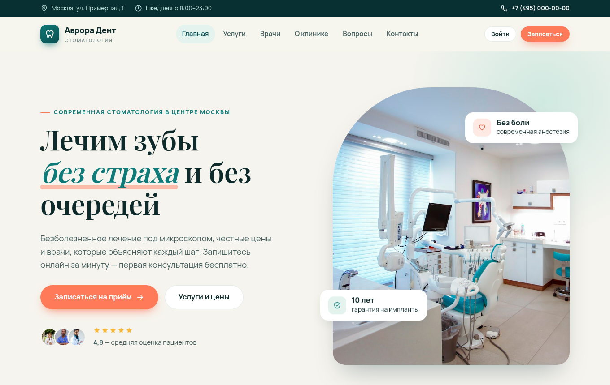

## Quick start

Docker Compose starts the application together with SQL Server and a mail catcher.

```bash
docker compose up --build
```

Open <http://localhost:8080>. The login page has one-click buttons for the demo
accounts, and the shared password is `Demo123!`. Every email sent by the
application (booking confirmations with a calendar file, password resets)
appears at <http://localhost:8025>.

| Role | Email | Scope |
|---|---|---|
| Patient | `client@clinic.demo` | Booking and cancelling visits, recommendations, a review |
| Doctor | `doctor@clinic.demo` | Live dashboard of the current visit, extending or finishing a visit, patient records |
| Manager | `manager@clinic.demo` | Review moderation queue |
| Administrator | `admin@clinic.demo` | Clinic overview, schedule, profiles, reviews |

For development on the host machine, start only the database and run the app.

```bash
docker compose up -d db
dotnet run
```

The app listens on <http://localhost:5000>. A ready image is published to
GitHub Container Registry by CI.

```bash
docker run -p 8080:8080 -e ConnectionStrings__DefaultConnection="..." ghcr.io/dognellaf/aurora-dent:latest
```

## Case study

### Problem

A small clinic needs a single place where patients see free time and book
visits without a phone call, doctors run the day including the visit in progress,
managers control which reviews get published, and administrators handle
everything else. Two patients must never end up with the same time slot, and
every role must see only the data required for the role.

### Solution

| Role | Cabinet |
|---|---|
| **Patient** | Upcoming visits and history with the doctor's recommendations, cancelling up to 2 hours before a visit, calendar file for every visit, one review passing moderation, own profile and password |
| **Doctor** | Current visit with a progress bar, schedule for the day, extending or finishing a visit with a reason, recommendations, patient history, generator of own free slots |
| **Manager** | Pending and published reviews with a counter, publish and hide actions |
| **Administrator** | Counters and the next visits, CRUD and bulk generation of schedule slots, profiles (create, edit, ban, delete) and reviews, with search and paging in every list |

Booking is a three-step flow on one page with an optional service, a doctor
filtered by the service, and a free time. Free time is visible to everyone, and
booking is reserved for patients.

### Engineering highlights

- **A slot cannot be booked twice.** Booking is a single
  `UPDATE ... WHERE Id = @id AND ClientId = 0` (`ExecuteUpdate`). Of two
  simultaneous requests only one changes a row, and the other receives a
  message about the time just taken. Integration tests cover the race
  between two patients.
- **Authorization lives in one place.** The `[RoleRequired]` filter resolves
  the signed-in profile once per request, checks the role, and signs out
  accounts banned or deleted while the cookie was still valid. Anonymous users
  are sent to the login page and users with another role to the access denied
  page. Tests check every role against every cabinet.
- **Migrations and a drift test.** The schema is created by EF Core migrations
  applied on startup, and the four roles are part of the model (`HasData`), so
  a fresh database is usable immediately. A test compares the model with the
  latest migration snapshot and fails when a model change comes without a
  migration.
- **Rules enforced by the database.** A foreign key from a visit to the
  patient (a free slot has no patient, instead of a magic zero), a unique index
  on doctor and start time, one review per patient, exact `decimal` prices.
  Tests show the database refusing violations, so the rules hold even when
  application code is bypassed.
- **Clinic time zone.** Visit times are clinic local time. `IClinicClock` is
  built on `TimeProvider` and a configured IANA zone, so containers running in
  UTC do not shift the schedule, and the clock is replaceable in tests.
- **Service layer.** Booking, schedule generation, profiles, reviews,
  notifications and calendar export live in services behind interfaces.
  Controllers only translate HTTP into service calls and results into
  responses.
- **Email failures stay contained.** Booking and cancelling send emails
  through SMTP (MailKit) with an `.ics` attachment. A failing mail server is
  logged and ignored, which a test proves. Without an SMTP host the sender only
  logs.
- **Structured logging.** Serilog writes events with named properties such as
  profile and appointment ids, and request logging is enabled.
- **Idempotent demo data.** The seeder runs only on an empty database and
  builds the schedule relative to the current date, including a visit in
  progress, so the doctor dashboard is never empty.
- **Consistent deletes.** Deleting a profile frees the future slots of the
  patient and removes the reviews. A released slot keeps nothing of the old
  visit, no recommendation and no services. A doctor with patients cannot be
  deleted, because the foreign keys would remove the visits of other people,
  so the profile is banned instead. A doctor without patients is removed with
  the staff card and the schedule. Creating a doctor creates the staff card as well, so
  the cabinet works immediately.
- **Operations built in.** A `/health` endpoint checks the database, and the
  Docker health check uses the endpoint. Every response carries security
  headers (Content Security Policy without inline scripts, `X-Frame-Options`,
  `nosniff`, referrer and permissions policies). Versioned static files are
  cached for a long time. Database connections are retried while the server
  starts.
- **No client-side framework.** Hand-written CSS design system with tokens in
  one stylesheet, about 100 lines of vanilla JS, an inline SVG icon sprite and
  self-hosted fonts. Cyrillic is rendered as is instead of `&#x...;` entities.
- **Accessible and responsive.** Semantic markup, visible focus states,
  `prefers-reduced-motion` support, a mobile menu, layouts checked at 390 px.

### Security

- Every POST carries an antiforgery token (`AutoValidateAntiforgeryToken`).
  Logout and booking are POST-only, so a link or an image cannot trigger either action.
- Banned accounts cannot sign in and are signed out on the next request. The
  ban is a separate column, so editing a profile leaves the ban untouched.
- Links in emails are built from the configured public address, so a forged
  Host header cannot redirect a password reset link to another site.
- Five wrong passwords lock an account for fifteen minutes, and a password
  reset lifts the lock.
- Password reset links are single use. The reset form answers the same way for
  known and unknown addresses, so registered emails cannot be discovered.
- Patients open and cancel only own visits, and anything else returns 404.
  Doctors work only with visits assigned to the doctor.
- The post-login `returnUrl` is accepted only when local.
- Input is validated on the server with Russian messages. Profile edits bind
  explicit view models instead of entities.
- A Content Security Policy forbids inline scripts and third-party code. A test
  scans the pages and fails on any inline script or `onclick`.
- Passwords are hashed by ASP.NET Core Identity. Demo accounts share a
  published password, so demo data is off by default and enabled only by the
  development settings and the Compose file.
- The ban message appears only after the right password, a banned account is
  treated as signed out on public pages, and a banned doctor disappears from
  the site and cannot be booked.
- `X-Forwarded-*` headers are believed only from configured proxy networks
  (private ranges by default). Doctors open records of patients assigned to them,
  not of everyone.

### Architecture

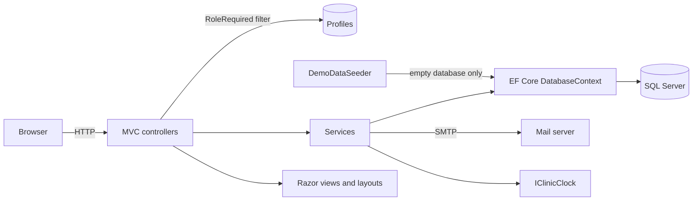

Data model.

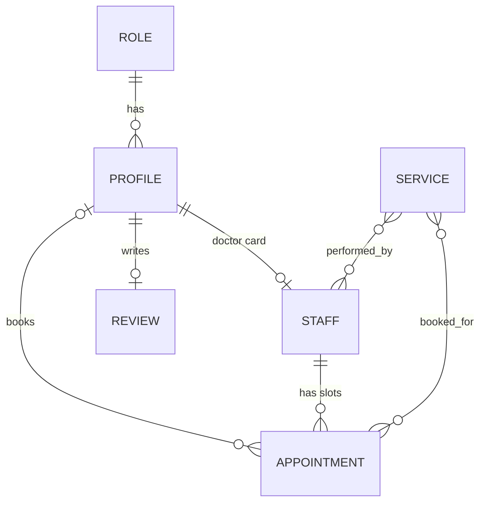

| Module | Responsibility |
|---|---|
| `Controllers/HomeController.cs` | Public pages, schedule browsing and atomic booking |
| `Controllers/{Auth,Account,Client,Doctor,Manager,Admin}Controller.cs` | Sign in and password reset, own profile, and one controller per role protected by `[RoleRequired]` |
| `Services/BookingService.cs` | Atomic booking and cancelling with the cancellation window |
| `Services/ScheduleService.cs` | Booking page data and bulk slot generation |
| `Services/ProfileService.cs`, `Services/ReviewService.cs` | Profile and review rules with consistent clean-up |
| `Services/Notifier.cs`, `Services/Email.cs`, `Services/CalendarExporter.cs` | Emails, SMTP delivery and `.ics` files |
| `Services/ClinicClock.cs` | Current time in the clinic time zone |
| `Infrastructure/RoleRequiredAttribute.cs` | Authentication, role check and ban enforcement |
| `Infrastructure/SecurityHeaders.cs` | CSP and other security headers |
| `Infrastructure/Fmt.cs` | Russian formatting for money, dates and declensions |
| `Data/DemoDataSeeder.cs` | Demo clinic with services, doctors, schedule, patients and reviews |
| `Data/Migrations/` | EF Core migrations |
| `Models/ViewModels/` | Shapes passed to views, which keeps views free of extra queries |
| `Views/Shared/_CabinetLayout.cshtml` | Shared layout of the four cabinets |

## Screenshots

| Online booking | Patient cabinet |
|---|---|
| 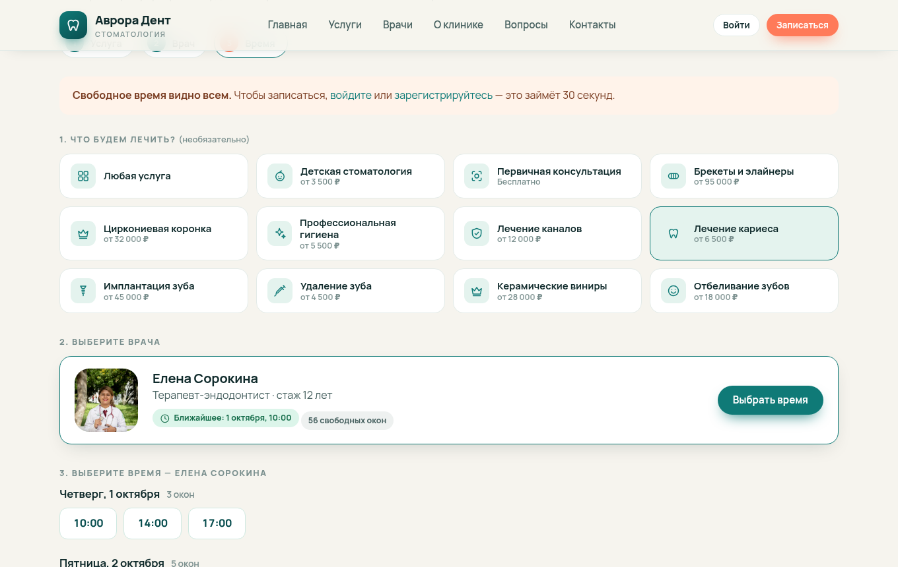 | 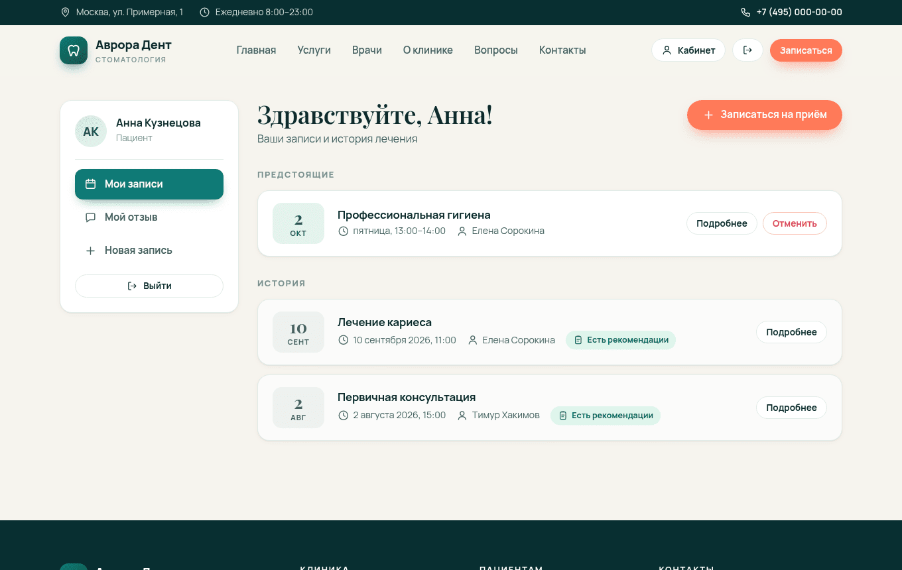 |

| Doctor dashboard | Administrator overview |
|---|---|
| 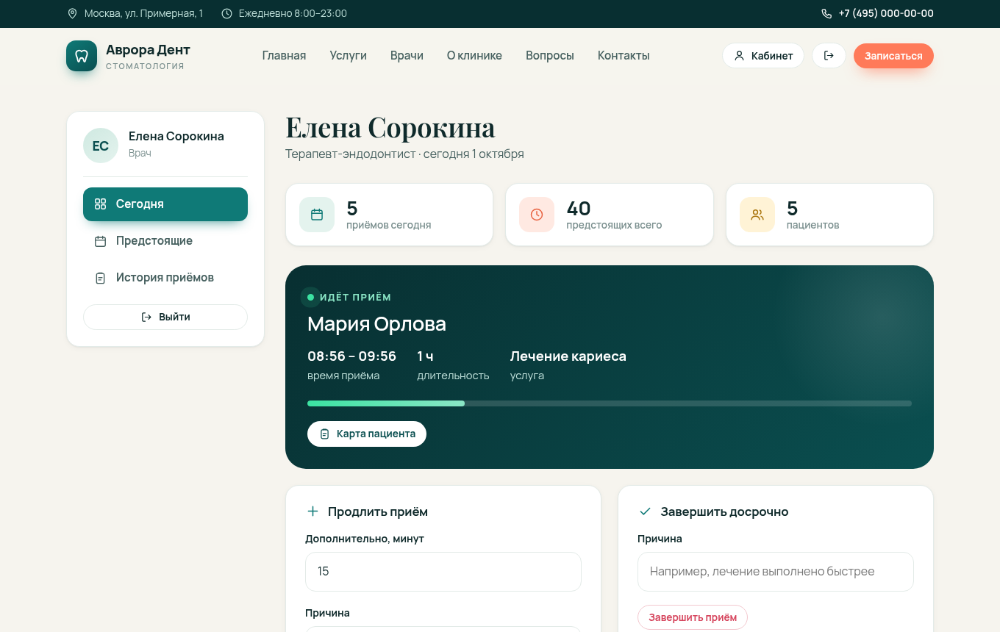 | 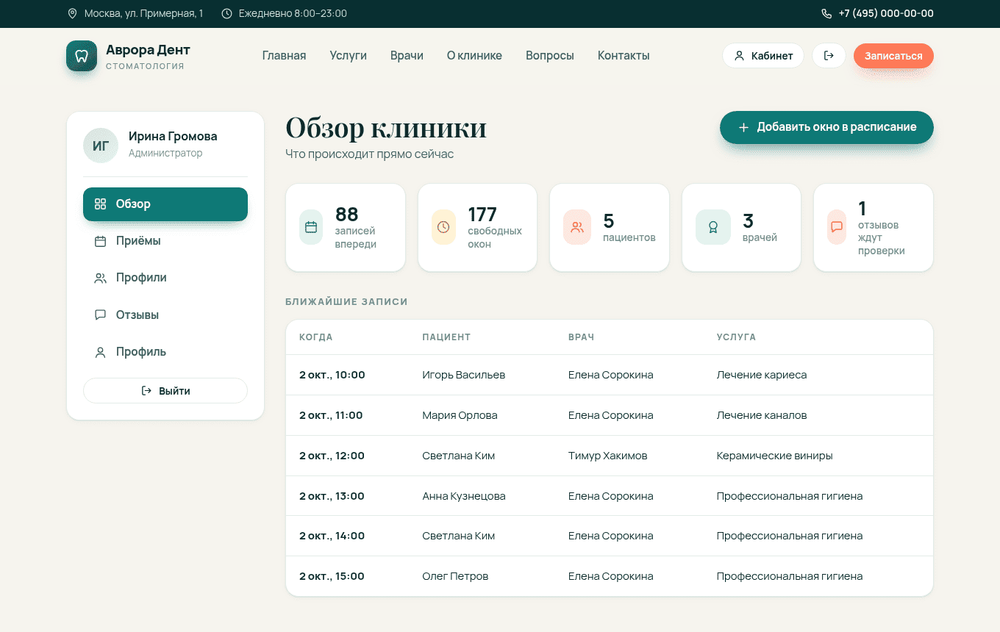 |

| Services | Review moderation |
|---|---|
| 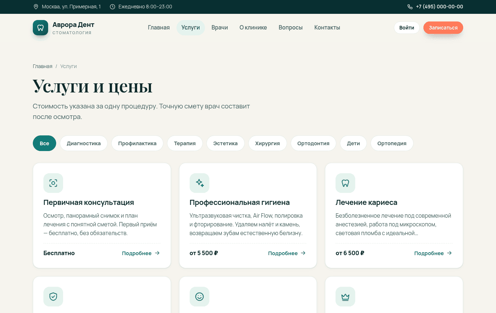 | 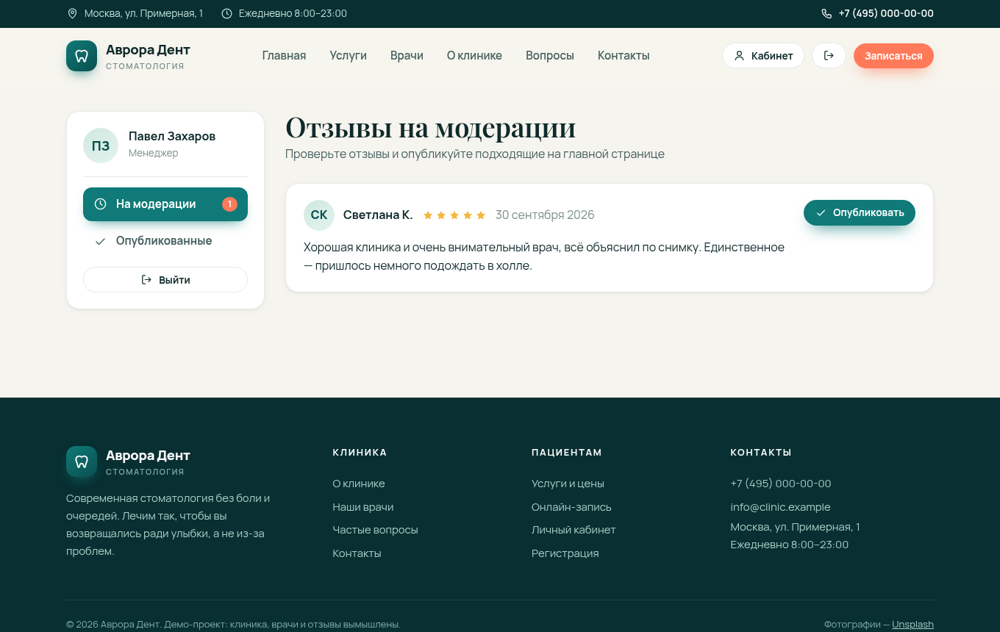 |

| Schedule generator | Administrator appointments |
|---|---|
| 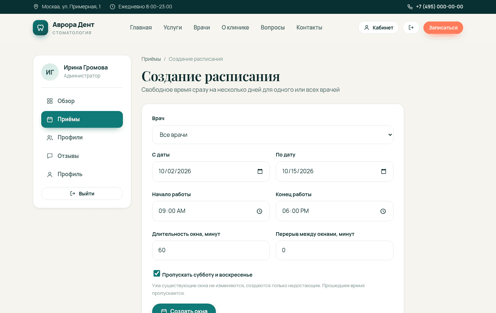 | 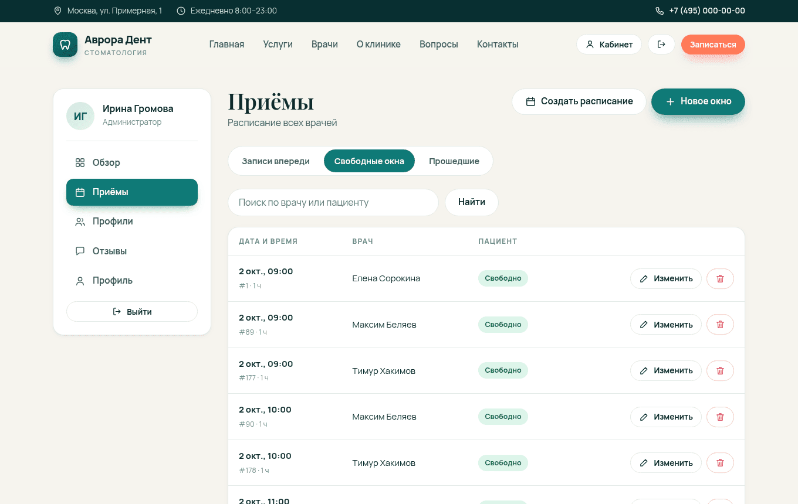 |

| Mobile home | Mobile booking |
|---|---|
| 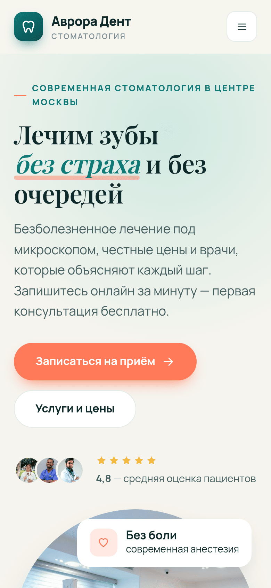 | 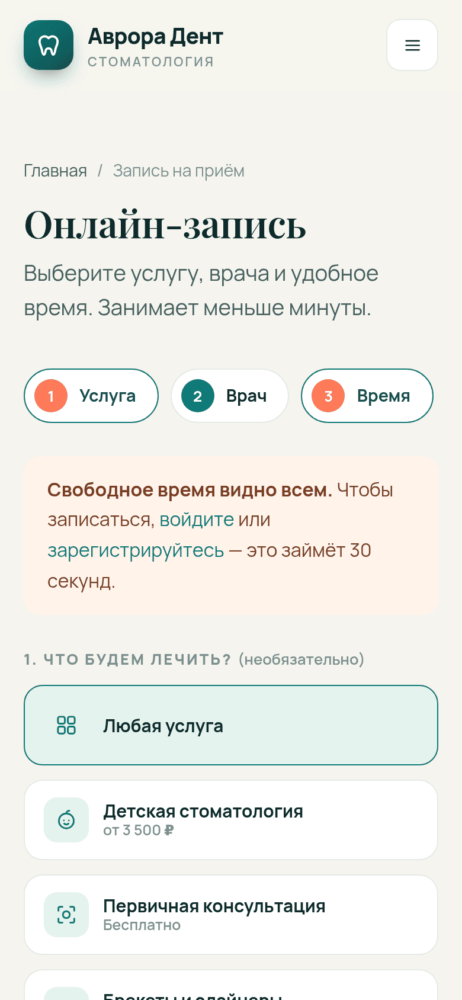 |

## Configuration

Settings come from `appsettings.json` or environment variables such as
`ConnectionStrings__DefaultConnection`.

| Key | Purpose | Default |
|---|---|---|
| `ConnectionStrings:DefaultConnection` | SQL Server connection string | `localhost,1433`, database `dental_clinic`, the `db` service of `docker-compose.yml` |
| `Seed:DemoData` | Fill an empty database with demo data, on in Development and in `docker-compose.yml` | `false` |
| `Bootstrap:AdminEmail`, `Bootstrap:AdminPassword`, `Bootstrap:AdminName` | Creates the first administrator when none exists | empty |
| `Hosting:TrustedProxies` | CIDR networks whose `X-Forwarded-*` headers are trusted | loopback and private ranges |
| `Hosting:HttpsRedirection` | Redirect HTTP to HTTPS, off because TLS is usually terminated by a proxy | `false` |
| `Clinic:TimeZone` | IANA time zone of the clinic, used for every visit time | `Europe/Moscow` |
| `Clinic:PublicUrl` | Public address of the site, used for links in emails instead of the request Host header | empty, derived from the request |
| `Clinic:Name`, `Clinic:Address`, `Clinic:Phone` | Facts shown in emails and calendar files | demo clinic |
| `Email:Host`, `Email:Port`, `Email:UseSsl`, `Email:User`, `Email:Password`, `Email:FromAddress` | SMTP server, empty host means emails are only logged | empty |

A real deployment leaves demo data off and sets `Bootstrap__AdminEmail` and
`Bootstrap__AdminPassword` once, which creates the first administrator at
startup. Role ids are 1 client, 2 administrator, 3 manager and 4 doctor.

### Migrations

Migrations are applied automatically on startup. A database with tables but
without migration history comes from an older version of the application, and
startup stops with an explanation. Such a database has to be dropped. A new
migration is created with the local EF tool.

```bash
dotnet tool restore
dotnet ef migrations add AddSomething --project DentalClinic.csproj -o Data/Migrations
```

## Tests

Tests need a SQL Server. The `db` service of Compose provides one.

```bash
docker compose up -d db
dotnet test
```

There are 172 tests with 97% line coverage. Most are integration tests starting
the whole application on a fresh database and use real HTTP requests,
cookies and antiforgery tokens. They cover public pages, access control for
every role, registration, login and bans, booking including the race for one
slot, cancelling, the visit controls of the doctor, the clean-up rules of the
administrator, review moderation, lockout, password reset, emails, bulk slot
generation, search and paging, database constraints, security headers and the
health check. The rest are service level tests and unit tests of the clinic
clock, the calendar export and the formatting helpers. Every test class creates a
separate database and drops the database afterwards. Another server can be
selected with the `TEST_SQLSERVER_CONNECTION` variable, a connection string without a database
name.

An end-to-end smoke test walks the real user journey over HTTP against a
running instance, covering health, public pages, sign in, booking and
cancelling, calendar download, lockout, paging and role separation. With
`SMOKE_MAIL_URL` set the test also verifies delivery of the confirmation email
to the mail server.

```bash
python3 docker/smoke_test.py http://localhost:8080
```

### CI

[`ci.yml`](.github/workflows/ci.yml) runs on every push and pull request.

| Job | Action |
|---|---|
| **Format and warnings** | `dotnet format` against `.editorconfig` and a Release build with warnings as errors |
| **Tests with coverage** | Whole suite against a SQL Server service container, including the migration drift test, failing below 85% line coverage, coverage written to the job summary |
| **Docker** | Builds the image, starts the Compose stack with the mail catcher, waits for the health checks and runs the smoke test |

[`docker-publish.yml`](.github/workflows/docker-publish.yml) pushes the image to
GitHub Container Registry from `master` and on version tags. Dependabot tracks
NuGet packages, GitHub Actions and base images. Local checks are listed in
[CONTRIBUTING.md](CONTRIBUTING.md).

## Project structure

```
├── Controllers/           # Public site and one controller per role
├── Data/                  # Demo-data seeder and EF Core migrations
├── Services/              # Booking, schedule, profiles, reviews, notifications, clock
├── Infrastructure/        # [RoleRequired] filter, security headers, paging, formatting helpers
├── Models/                # EF entities, DTOs and view models
├── Views/                 # Razor views, layouts and partials
├── wwwroot/               # CSS, JS, fonts and images
├── DentalClinic.Tests/    # xUnit integration and unit tests
├── docker/smoke_test.py   # End-to-end smoke test of a running instance
├── docs/screenshots/
├── Dockerfile
├── docker-compose.yml     # Application, SQL Server and a mail catcher
└── .github/               # CI, image publishing, Dependabot, PR template
```

## Credits

Photos from [Unsplash](https://unsplash.com) under the Unsplash License.
Clinic interior by Benyamin Bohlouli, X-ray review by Jonathan Borba, smile by
Dr Farid Sharifi, doctor portraits by Siednji Leon, Bruno Rodrigues and Usman
Yousaf. Fonts Manrope and Playfair Display (SIL OFL) via Fontsource.

## License

[PolyForm Noncommercial 1.0.0](LICENSE). Use, modification and redistribution
are allowed for any noncommercial purpose, provided the notice
`Copyright (c) 2026 DogNellaf` is kept. Commercial use requires a separate
license from [DogNellaf](https://github.com/DogNellaf).
