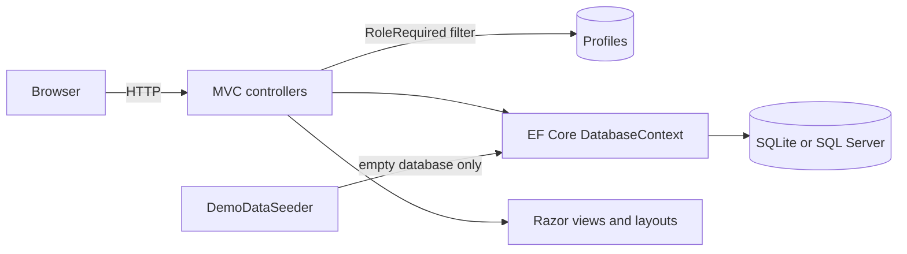

# Aurora Dent

> 🇬🇧 English | [🇷🇺 Русский](README.ru.md)

[](https://github.com/DogNellaf/dental-clinic/actions/workflows/ci.yml)


A web app for a dental clinic: a public site with online booking and separate
cabinets for patients, doctors, managers and administrators. It runs out of the
box on SQLite and fills an empty database with a realistic demo clinic, so there
is nothing to install or configure. The interface is in Russian. The clinic,
doctors and reviews are fictional; photos are from [Unsplash](https://unsplash.com).


## Quick start

```bash
dotnet run
```

Open the address printed in the console (by default <http://localhost:5000>).
The first start creates `App_Data/clinic.db` with services, three doctors, a
two-week schedule, patients and reviews. The login page has one-click buttons
for the demo accounts (password for all of them is `Demo123!`):

| Role | Email | What it shows |
|---|---|---|
| Patient | `client@clinic.demo` | Booking and cancelling visits, recommendations, a review |
| Doctor | `doctor@clinic.demo` | Live "current visit" dashboard, extend or finish early, patient records |
| Manager | `manager@clinic.demo` | Review moderation queue |
| Administrator | `admin@clinic.demo` | Clinic overview, schedule, profiles, reviews |

With Docker:

```bash
docker build -t aurora-dent .
docker run -p 8080:8080 -v aurora-data:/data aurora-dent
```

## Case study

### Problem

A small clinic needs one place where patients can see free time and book it
without calling, doctors can run their day (including the visit that is
happening right now), managers can control what is published as a review, and
administrators can manage everything else. Two patients must never end up with
the same time slot, and each role must see only what it needs.

### Solution

| Role | Cabinet |
|---|---|
| **Patient** | Upcoming visits and history with the doctor's recommendations, cancelling up to 2 hours before a visit, one review that goes through moderation |
| **Doctor** | The current visit with a progress bar, today's schedule, extending or finishing a visit with a reason, recommendations, a patient's history |
| **Manager** | Pending and published reviews with a counter, publish and hide |
| **Administrator** | Counters and the next visits, CRUD for schedule slots, profiles (create, edit, ban, delete) and reviews |

Booking is a three-step flow on one page: service (optional), then a doctor
filtered by that service, then a free time. Free time is visible to everyone;
only patients can book it.

### Engineering highlights

- **A slot cannot be booked twice.** Booking is a single
  `UPDATE … WHERE Id = @id AND ClientId = 0` (`ExecuteUpdate`). Only one of two
  simultaneous requests changes a row; the other gets "this time was just
  taken". Integration tests cover the race between two patients.
- **Authorization lives in one place.** The `[RoleRequired]` filter resolves
  the signed-in profile once per request, checks the role, and signs out
  accounts that were banned or deleted while their cookie was still valid.
  Anonymous users go to the login page, users with the wrong role to "access
  denied". Tests check every role against every cabinet.
- **Zero-setup database.** SQLite by default, SQL Server by configuration
  (`Database:Provider`). The four roles are part of the EF model (`HasData`),
  so a fresh database is usable immediately.
- **Idempotent demo data.** The seeder runs only on an empty database and builds
  a schedule relative to the current date, including a visit in progress right
  now, so the doctor dashboard is never empty.
- **Consistent deletes.** Deleting a profile frees the patient's future slots
  and removes their reviews; deleting a doctor also removes the staff card and
  schedule. Creating a doctor creates the staff card too, so the cabinet works
  immediately.
- **No client-side framework.** A hand-written CSS design system (tokens, one
  stylesheet), about 100 lines of vanilla JS, an inline SVG icon sprite and
  self-hosted fonts. Cyrillic is rendered as-is instead of `&#x...;` entities.
- **Accessible and responsive.** Semantic markup, visible focus states,
  `prefers-reduced-motion` support, a mobile menu, layouts checked at 390 px.

### Security

- Every POST carries an antiforgery token (`AutoValidateAntiforgeryToken`);
  logout and booking are POST-only, so a link or an image cannot trigger them.
- Banned accounts cannot sign in, and are signed out on their next request.
- Patients can open and cancel only their own visits; anything else is a 404.
  Doctors work only with their own visits.
- The post-login `returnUrl` is accepted only if it is local.
- Input is validated on the server with Russian messages; mass assignment is
  avoided by binding explicit view models for profile edits.
- Passwords are hashed by ASP.NET Core Identity. The demo accounts share a
  published password, so set `Seed__DemoData=false` in any real deployment.

### Architecture



| Module | Responsibility |
|---|---|
| `Controllers/HomeController.cs` | Public pages, schedule browsing and atomic booking |
| `Controllers/{Auth,Client,Doctor,Manager,Admin}Controller.cs` | One controller per role, protected by `[RoleRequired]` |
| `Infrastructure/RoleRequiredAttribute.cs` | Authentication, role check and ban enforcement |
| `Infrastructure/Fmt.cs` | Russian formatting: money, dates, declensions |
| `Data/DemoDataSeeder.cs` | Demo clinic: services, doctors, schedule, patients, reviews |
| `Models/ViewModels/` | Shapes passed to views so they never run extra queries |
| `Views/Shared/_CabinetLayout.cshtml` | Shared layout of all four cabinets |

### What the overhaul changed

The project started as a coursework prototype. Getting it to a presentable
state involved:

- fixing the missing `bootstrap.min.css` and `jquery.min.js` files that left
  the site without styles, then replacing Bootstrap with a hand-written design
  system, new photography and a redesign of every page;
- replacing the required SQL Server and the manual "insert the roles with this
  SQL" step with SQLite, seeded roles and a demo-data seeder;
- adding step-by-step online booking with an atomic slot claim, cancelling and
  doctor profiles;
- moving the repeated `if (!authenticated) … if (!profile.IsDoctor)` checks of
  every action into one filter, and making state-changing actions POST with
  antiforgery tokens (booking and logout used to be GET);
- making bans real: they used to change a flag that nothing checked;
- creating a staff card when an administrator adds a doctor, which used to
  leave that doctor with an unusable cabinet;
- adding integration tests, a Dockerfile and CI, and deleting dead
  placeholder files.

## Screenshots

| Online booking | Patient cabinet |
|---|---|
|  |  |

| Doctor dashboard | Administrator overview |
|---|---|
|  |  |

| Services | Review moderation |
|---|---|
|  |  |

| Mobile home | Mobile booking |
|---|---|
|  |  |

## Running with SQL Server

```bash
dotnet run --Database:Provider=SqlServer \
  --ConnectionStrings:DefaultConnection="Server=.\SQLEXPRESS;Database=dental_clinic;Trusted_Connection=True;Encrypt=False;"
```

Tables and roles are created on the first start (`EnsureCreated`). There are no
migrations: the project is a showcase, and the schema is created from the model.

## Configuration

Settings come from `appsettings.json` or environment variables
(`Database__Provider`, `Seed__DemoData`, …).

| Key | Purpose | Default |
|---|---|---|
| `Database:Provider` | `Sqlite` or `SqlServer` | `Sqlite` |
| `ConnectionStrings:DefaultConnection` | Connection string of the chosen provider | `Data Source=App_Data/clinic.db` |
| `Seed:DemoData` | Fill an empty database with demo data | `true` |
| `Hosting:HttpsRedirection` | Redirect HTTP to HTTPS (off because TLS is usually terminated by a proxy) | `false` |

The first administrator in a real deployment has to be created in the database
(roles: 1 client, 2 administrator, 3 manager, 4 doctor).

## Tests

```bash
dotnet test
```

There are 54 tests. Most are integration tests that start the whole app
against a temporary SQLite file and use real HTTP requests, cookies and
antiforgery tokens: public pages, access control for every role, registration,
login and bans, booking including the race for one slot, cancelling,
recommendations and the review moderation flow. The rest are unit tests of the
formatting helpers. No external services are needed.

CI ([`.github/workflows/ci.yml`](.github/workflows/ci.yml)) builds in Release
and runs the tests on every push and pull request.

## Project structure

```
├── Controllers/           # Public site and one controller per role
├── Data/                  # Demo-data seeder
├── Infrastructure/        # [RoleRequired] filter and formatting helpers
├── Models/                # EF entities, DTOs and view models
├── Views/                 # Razor views, layouts and partials
├── wwwroot/               # CSS, JS, fonts and images
├── DentalClinic.Tests/    # xUnit integration and unit tests
├── docs/screenshots/
├── Dockerfile
└── .github/workflows/ci.yml
```

## Credits

Photos from [Unsplash](https://unsplash.com) under the Unsplash License:
clinic interior by Benyamin Bohlouli, X-ray review by Jonathan Borba, smile by
Dr Farid Sharifi, doctor portraits by Siednji Leon, Bruno Rodrigues and Usman
Yousaf. Fonts: Manrope and Playfair Display (SIL OFL) via Fontsource.

## License

[MIT](LICENSE)
