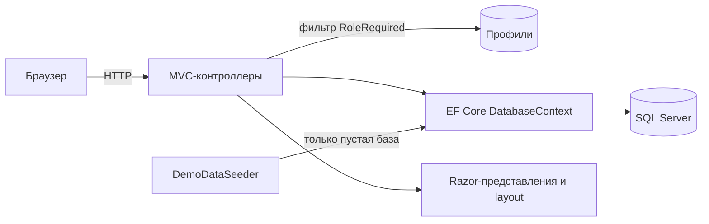

# Аврора Дент

> [🇬🇧 English](README.md) | 🇷🇺 Русский

[](https://github.com/DogNellaf/dental-clinic/actions/workflows/ci.yml)


Веб-приложение стоматологической клиники. Публичный сайт предлагает онлайн-запись,
а отдельные кабинеты обслуживают пациентов, врачей, менеджеров и администраторов.
Данные хранятся в SQL Server, пустая база заполняется демо-клиникой при первом
запуске. Интерфейс на русском языке. Клиника, врачи и отзывы вымышлены,
фотографии взяты с [Unsplash](https://unsplash.com).


## Быстрый старт

Docker Compose запускает приложение вместе с SQL Server.

```bash
docker compose up --build
```

Открыть <http://localhost:8080>. На странице входа есть кнопки быстрого входа в
демо-аккаунты, пароль у всех `Demo123!`.

| Роль | Email | Возможности |
|---|---|---|
| Пациент | `client@clinic.demo` | Запись и отмена визитов, рекомендации, отзыв |
| Врач | `doctor@clinic.demo` | Дашборд текущего приёма, продление и досрочное завершение, карта пациента |
| Менеджер | `manager@clinic.demo` | Очередь модерации отзывов |
| Администратор | `admin@clinic.demo` | Обзор клиники, расписание, профили, отзывы |

Для разработки на локальной машине достаточно поднять только базу и запустить
приложение.

```bash
docker compose up -d db
dotnet run
```

Приложение слушает <http://localhost:5000>. Готовый образ публикуется в GitHub
Container Registry из CI.

```bash
docker run -p 8080:8080 -e ConnectionStrings__DefaultConnection="..." ghcr.io/dognellaf/dental-clinic:latest
```

## Кейс

### Задача

Небольшой клинике нужно единое место, где пациенты видят свободное время и
записываются без звонка, врачи ведут день, включая идущий приём, менеджеры
контролируют публикацию отзывов, а администраторы занимаются остальным. Два
пациента не должны оказаться на одном времени, а каждая роль должна видеть
только нужные данные.

### Решение

| Роль | Кабинет |
|---|---|
| **Пациент** | Предстоящие визиты и история с рекомендациями врача, отмена не позднее чем за 2 часа, один отзыв с модерацией |
| **Врач** | Текущий приём с индикатором прогресса, расписание на день, продление или досрочное завершение с причиной, рекомендации, история пациента |
| **Менеджер** | Отзывы на модерации и опубликованные со счётчиком, действия публикации и скрытия |
| **Администратор** | Счётчики и ближайшие записи, CRUD окон расписания, профилей (создание, правка, блокировка, удаление) и отзывов |

Запись проходит тремя шагами на одной странице, с необязательной услугой, врачом,
отфильтрованным по услуге, и свободным временем. Свободное время видно всем,
записаться могут только пациенты.

### Инженерные решения

- **Одно окно нельзя занять дважды.** Запись выполняется одним запросом
  `UPDATE ... WHERE Id = @id AND ClientId = 0` (`ExecuteUpdate`). Из двух
  одновременных запросов строку изменяет только один, другой получает сообщение,
  что время только что заняли. Интеграционные тесты проверяют гонку двух
  пациентов.
- **Авторизация в одном месте.** Фильтр `[RoleRequired]` один раз за запрос
  находит профиль, проверяет роль и разлогинивает аккаунты, заблокированные или
  удалённые при ещё действующем cookie. Анонимные пользователи попадают на
  страницу входа, пользователи с другой ролью на страницу отказа в доступе.
  Тесты проверяют каждую роль против каждого кабинета.
- **Схема и роли берутся из модели.** Четыре роли входят в модель EF
  (`HasData`), поэтому свежая база сразу пригодна к работе.
- **Идемпотентные демо-данные.** Сидер срабатывает только на пустой базе и строит
  расписание относительно текущей даты, включая идущий приём, поэтому дашборд
  врача никогда не пустой.
- **Согласованное удаление.** Удаление профиля освобождает будущие окна пациента
  и удаляет отзывы. Удаление врача убирает также карточку и расписание. Создание
  врача создаёт и карточку, поэтому кабинет работает сразу.
- **Эксплуатация из коробки.** Эндпоинт `/health` проверяет базу, на нём
  построен Docker health check. Каждый ответ содержит заголовки безопасности
  (Content Security Policy без inline-скриптов, `X-Frame-Options`, `nosniff`,
  политики referrer и permissions). Статика с версиями кэшируется надолго.
  Подключения к базе повторяются, пока сервер запускается.
- **Без клиентского фреймворка.** Дизайн-система на чистом CSS с токенами в одном
  файле стилей, около 100 строк обычного JS, SVG-спрайт иконок и шрифты в
  проекте. Кириллица отдаётся как есть, без сущностей `&#x...;`.
- **Доступность и адаптивность.** Семантическая разметка, видимый фокус,
  поддержка `prefers-reduced-motion`, мобильное меню, вёрстка проверена на 390 px.

### Безопасность

- Каждый POST несёт antiforgery-токен (`AutoValidateAntiforgeryToken`). Выход и
  запись работают только через POST, поэтому ссылка или картинка не запускают
  действие.
- Заблокированные аккаунты не входят и разлогиниваются при следующем запросе.
- Пациенты открывают и отменяют только собственные визиты, остальное возвращает
  404. Врачи работают только с приёмами, назначенными врачу.
- `returnUrl` после входа принимается только локальный.
- Ввод проверяется на сервере, сообщения на русском. Правка профиля привязывает
  явные view-модели вместо сущностей.
- Content Security Policy запрещает inline-скрипты и сторонний код. Тест
  просматривает страницы, чтобы inline-скрипт или `onclick` не проскочили.
- Пароли хэшируются средствами ASP.NET Core Identity. Демо-аккаунты используют
  общий опубликованный пароль, поэтому в боевом запуске обязателен
  `Seed__DemoData=false`.

### Архитектура



| Модуль | Ответственность |
|---|---|
| `Controllers/HomeController.cs` | Публичные страницы, просмотр расписания и атомарная запись |
| `Controllers/{Auth,Client,Doctor,Manager,Admin}Controller.cs` | По контроллеру на роль, защита через `[RoleRequired]` |
| `Infrastructure/RoleRequiredAttribute.cs` | Аутентификация, проверка роли и блокировки |
| `Infrastructure/SecurityHeaders.cs` | CSP и другие заголовки безопасности |
| `Infrastructure/Fmt.cs` | Русское форматирование денег, дат и склонений |
| `Data/DemoDataSeeder.cs` | Демо-клиника с услугами, врачами, расписанием, пациентами и отзывами |
| `Models/ViewModels/` | Модели для представлений, чтобы представления не делали лишних запросов |
| `Views/Shared/_CabinetLayout.cshtml` | Общий layout четырёх кабинетов |

## Скриншоты

| Онлайн-запись | Кабинет пациента |
|---|---|
|  |  |

| Кабинет врача | Обзор администратора |
|---|---|
|  |  |

| Услуги | Модерация отзывов |
|---|---|
|  |  |

| Главная на телефоне | Запись на телефоне |
|---|---|
|  |  |

## Конфигурация

Настройки берутся из `appsettings.json` или переменных окружения, например
`ConnectionStrings__DefaultConnection`.

| Ключ | Назначение | По умолчанию |
|---|---|---|
| `ConnectionStrings:DefaultConnection` | Строка подключения к SQL Server | `localhost,1433`, база `dental_clinic`, сервис `db` из `docker-compose.yml` |
| `Seed:DemoData` | Заполнение пустой базы демо-данными | `true` |
| `Hosting:HttpsRedirection` | Перенаправление HTTP на HTTPS, выключено, так как TLS обычно завершает прокси | `false` |

Таблицы и роли создаются при первом запуске через `EnsureCreated`. Миграции не
используются, схема строится из модели. Первого администратора боевого
развёртывания нужно создать в базе. Идентификаторы ролей 1 клиент,
2 администратор, 3 менеджер и 4 доктор.

## Тесты

Тестам нужен SQL Server. Сервис `db` из Compose предоставляет такой сервер.

```bash
docker compose up -d db
dotnet test
```

Всего 96 тестов, покрытие строк 97%. Большинство интеграционные, с запуском
всего приложения на свежей базе и используют настоящие HTTP-запросы, cookie и
antiforgery-токены. Покрыты публичные страницы, доступ для каждой роли,
регистрация, вход и блокировки, запись с гонкой за одно окно, отмена, управление
приёмом у врача, правила очистки у администратора, модерация отзывов, заголовки
безопасности и health check. Остальные тесты проверяют форматирование. Каждый
тестовый класс создаёт отдельную базу и удаляет базу после завершения. Другой
сервер выбирается переменной `TEST_SQLSERVER_CONNECTION`, строкой подключения без
имени базы.

Сквозной smoke-тест проходит пользовательский путь по HTTP на запущенном
экземпляре и проверяет health, публичные страницы, вход, запись и отмену,
разделение ролей.

```bash
python3 docker/smoke_test.py http://localhost:8080
```

### CI

[`ci.yml`](.github/workflows/ci.yml) запускается при каждом push и pull request.

| Задача | Действие |
|---|---|
| **Format and warnings** | `dotnet format` по `.editorconfig` и сборка Release с предупреждениями как ошибками |
| **Tests with coverage** | Весь набор на контейнере SQL Server, падение при покрытии строк ниже 85%, покрытие в summary задачи |
| **Docker** | Сборка образа, запуск стенда Compose, ожидание health check и запуск smoke-теста |

[`docker-publish.yml`](.github/workflows/docker-publish.yml) публикует образ в
GitHub Container Registry из `master` и по тегам версий. Dependabot отслеживает
пакеты NuGet, GitHub Actions и базовые образы. Локальные проверки описаны в
[CONTRIBUTING.md](CONTRIBUTING.md).

## Структура проекта

```
├── Controllers/           # Публичный сайт и по контроллеру на роль
├── Data/                  # Сидер демо-данных
├── Infrastructure/        # Фильтр [RoleRequired], заголовки безопасности, форматирование
├── Models/                # Сущности EF, DTO и view-модели
├── Views/                 # Razor-представления, layout и partial
├── wwwroot/               # CSS, JS, шрифты и изображения
├── DentalClinic.Tests/    # Интеграционные и unit-тесты xUnit
├── docker/smoke_test.py   # Сквозной smoke-тест запущенного экземпляра
├── docs/screenshots/
├── Dockerfile
├── docker-compose.yml     # Приложение и SQL Server
└── .github/               # CI, публикация образа, Dependabot, шаблон PR
```

## Благодарности

Фотографии с [Unsplash](https://unsplash.com) по лицензии Unsplash. Интерьер
Benyamin Bohlouli, снимки КТ Jonathan Borba, улыбка Dr Farid Sharifi, портреты
врачей Siednji Leon, Bruno Rodrigues и Usman Yousaf. Шрифты Manrope и Playfair
Display (SIL OFL) через Fontsource.

## Лицензия

[PolyForm Noncommercial 1.0.0](LICENSE). Использование, изменение и
распространение разрешены для любых некоммерческих целей при сохранении
уведомления `Copyright (c) 2026 DogNellaf`. Коммерческое использование требует
отдельной лицензии от [DogNellaf](https://github.com/DogNellaf).
