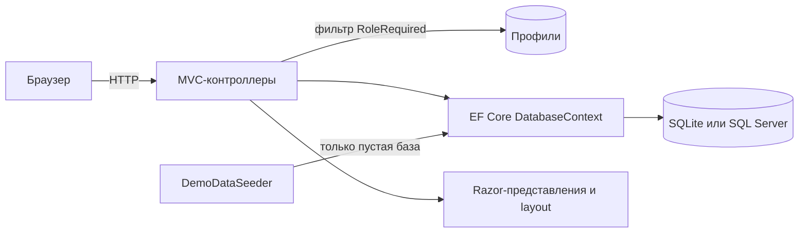

# Аврора Дент

> [🇬🇧 English](README.md) | 🇷🇺 Русский

[](https://github.com/DogNellaf/dental-clinic/actions/workflows/ci.yml)


Веб-приложение стоматологической клиники: публичный сайт с онлайн-записью и
отдельные кабинеты для пациентов, врачей, менеджеров и администраторов.
Запускается «из коробки» на SQLite и заполняет пустую базу реалистичной
демо-клиникой, поэтому ничего устанавливать и настраивать не нужно. Интерфейс
на русском. Клиника, врачи и отзывы вымышлены; фотографии с
[Unsplash](https://unsplash.com).


## Быстрый старт

```bash
dotnet run
```

Откройте адрес из консоли (по умолчанию <http://localhost:5000>). При первом
запуске создаётся `App_Data/clinic.db` с услугами, тремя врачами, расписанием на
две недели, пациентами и отзывами. На странице входа есть кнопки быстрого входа
в демо-аккаунты (пароль у всех `Demo123!`):

| Роль | Email | Что показывает |
|---|---|---|
| Пациент | `client@clinic.demo` | Запись и отмена визитов, рекомендации, отзыв |
| Врач | `doctor@clinic.demo` | Дашборд текущего приёма, продление и досрочное завершение, карта пациента |
| Менеджер | `manager@clinic.demo` | Очередь модерации отзывов |
| Администратор | `admin@clinic.demo` | Обзор клиники, расписание, профили, отзывы |

Через Docker:

```bash
docker build -t aurora-dent .
docker run -p 8080:8080 -v aurora-data:/data aurora-dent
```

## Кейс

### Задача

Небольшой клинике нужно одно место, где пациенты видят свободное время и
записываются без звонка, врачи ведут свой день (включая приём, который идёт
прямо сейчас), менеджеры контролируют, какие отзывы публикуются, а
администраторы управляют всем остальным. Два пациента не должны оказаться на
одном и том же времени, а каждая роль должна видеть только нужное ей.

### Решение

| Роль | Кабинет |
|---|---|
| **Пациент** | Предстоящие визиты и история с рекомендациями врача, отмена не позднее чем за 2 часа, один отзыв с модерацией |
| **Врач** | Текущий приём с индикатором прогресса, расписание на день, продление или досрочное завершение с причиной, рекомендации, история пациента |
| **Менеджер** | Отзывы на модерации и опубликованные со счётчиком, публикация и скрытие |
| **Администратор** | Счётчики и ближайшие записи, CRUD окон расписания, профилей (создание, правка, блокировка, удаление) и отзывов |

Запись — это три шага на одной странице: услуга (необязательно), затем врач,
отфильтрованный по услуге, затем свободное время. Свободное время видно всем,
записаться могут только пациенты.

### Инженерные решения

- **Одно окно нельзя занять дважды.** Запись — это один запрос
  `UPDATE … WHERE Id = @id AND ClientId = 0` (`ExecuteUpdate`). Из двух
  одновременных запросов строку изменит только один, второй получит сообщение
  «это время только что заняли». Интеграционные тесты проверяют гонку двух
  пациентов.
- **Авторизация в одном месте.** Фильтр `[RoleRequired]` один раз за запрос
  находит профиль, проверяет роль и разлогинивает аккаунты, которые заблокировали
  или удалили, пока cookie ещё действовал. Анонимов он отправляет на страницу
  входа, пользователей с чужой ролью — на «доступ ограничен». Тесты проверяют
  каждую роль против каждого кабинета.
- **База без настройки.** По умолчанию SQLite, SQL Server — через конфигурацию
  (`Database:Provider`). Четыре роли входят в модель EF (`HasData`), поэтому
  свежая база сразу пригодна к работе.
- **Идемпотентные демо-данные.** Сидер срабатывает только на пустой базе и
  строит расписание относительно текущей даты, включая приём, идущий прямо
  сейчас, так что дашборд врача никогда не пустой.
- **Согласованное удаление.** Удаление профиля освобождает будущие окна пациента
  и удаляет его отзывы; удаление врача убирает ещё и карточку и расписание.
  Создание врача создаёт и карточку, поэтому кабинет работает сразу.
- **Без клиентского фреймворка.** Собственная дизайн-система на CSS (токены,
  один файл стилей), около 100 строк обычного JS, SVG-спрайт иконок и шрифты в
  проекте. Кириллица отдаётся как есть, а не в виде `&#x...;`.
- **Доступность и адаптивность.** Семантическая разметка, видимый фокус,
  поддержка `prefers-reduced-motion`, мобильное меню, вёрстка проверена на 390 px.

### Безопасность

- Каждый POST несёт antiforgery-токен (`AutoValidateAntiforgeryToken`); выход и
  запись — только POST, поэтому ссылка или картинка не могут их вызвать.
- Заблокированные аккаунты не могут войти и разлогиниваются при следующем
  запросе.
- Пациент открывает и отменяет только свои визиты, всё остальное — 404. Врач
  работает только со своими приёмами.
- `returnUrl` после входа принимается только локальный.
- Ввод валидируется на сервере с русскими сообщениями; при правке профиля
  привязываются явные view-модели, а не сущности.
- Пароли хэширует ASP.NET Core Identity. У демо-аккаунтов общий опубликованный
  пароль, поэтому в боевом запуске задайте `Seed__DemoData=false`.

### Архитектура



| Модуль | Ответственность |
|---|---|
| `Controllers/HomeController.cs` | Публичные страницы, просмотр расписания и атомарная запись |
| `Controllers/{Auth,Client,Doctor,Manager,Admin}Controller.cs` | По контроллеру на роль, защищены `[RoleRequired]` |
| `Infrastructure/RoleRequiredAttribute.cs` | Аутентификация, проверка роли и блокировки |
| `Infrastructure/Fmt.cs` | Русское форматирование: деньги, даты, склонения |
| `Data/DemoDataSeeder.cs` | Демо-клиника: услуги, врачи, расписание, пациенты, отзывы |
| `Models/ViewModels/` | Модели для представлений, чтобы они не делали лишних запросов |
| `Views/Shared/_CabinetLayout.cshtml` | Общий layout четырёх кабинетов |

### Что изменилось при доработке

Проект начинался как учебный прототип. Чтобы довести его до презентабельного
вида, понадобилось:

- починить отсутствующие `bootstrap.min.css` и `jquery.min.js`, из-за которых
  сайт был без стилей, затем заменить Bootstrap собственной дизайн-системой,
  добавить фотографии и переработать каждую страницу;
- заменить обязательный SQL Server и ручной шаг «вставьте роли этим SQL» на
  SQLite, роли в модели и сидер демо-данных;
- добавить пошаговую онлайн-запись с атомарным занятием окна, отмену записи и
  профили врачей;
- вынести повторяющиеся проверки `if (!authenticated) … if (!profile.IsDoctor)`
  из каждого действия в один фильтр, а действия, меняющие состояние, сделать
  POST с antiforgery-токенами (запись и выход были GET);
- сделать блокировку настоящей: раньше она меняла флаг, который никто не
  проверял;
- создавать карточку сотрудника, когда администратор добавляет врача: раньше у
  такого врача не открывался кабинет;
- добавить интеграционные тесты, Dockerfile и CI, удалить пустые файлы-заглушки.

## Скриншоты

| Онлайн-запись | Кабинет пациента |
|---|---|
|  |  |

| Кабинет врача | Обзор администратора |
|---|---|
|  |  |

| Услуги | Модерация отзывов |
|---|---|
|  |  |

| Главная на телефоне | Запись на телефоне |
|---|---|
|  |  |

## Запуск на SQL Server

```bash
dotnet run --Database:Provider=SqlServer \
  --ConnectionStrings:DefaultConnection="Server=.\SQLEXPRESS;Database=dental_clinic;Trusted_Connection=True;Encrypt=False;"
```

Таблицы и роли создаются при первом запуске (`EnsureCreated`). Миграций нет:
проект демонстрационный, схема строится из модели.

## Конфигурация

Настройки берутся из `appsettings.json` или переменных окружения
(`Database__Provider`, `Seed__DemoData`, …).

| Ключ | Назначение | По умолчанию |
|---|---|---|
| `Database:Provider` | `Sqlite` или `SqlServer` | `Sqlite` |
| `ConnectionStrings:DefaultConnection` | Строка подключения выбранного провайдера | `Data Source=App_Data/clinic.db` |
| `Seed:DemoData` | Заполнять пустую базу демо-данными | `true` |
| `Hosting:HttpsRedirection` | Перенаправлять HTTP на HTTPS (выключено: TLS обычно завершает прокси) | `false` |

Первого администратора в боевом запуске нужно создать в базе (роли: 1 клиент,
2 администратор, 3 менеджер, 4 доктор).

## Тесты

```bash
dotnet test
```

Всего 54 теста. Большинство — интеграционные: они запускают всё приложение на
временном файле SQLite и используют настоящие HTTP-запросы, cookie и
antiforgery-токены: публичные страницы, доступ для каждой роли, регистрация,
вход и блокировки, запись, включая гонку за одно окно, отмена, рекомендации и
модерация отзывов. Остальные — unit-тесты форматирования. Внешние сервисы не
нужны.

CI ([`.github/workflows/ci.yml`](.github/workflows/ci.yml)) собирает проект в
Release и запускает тесты при каждом push и pull request.

## Структура проекта

```
├── Controllers/           # Публичный сайт и по контроллеру на роль
├── Data/                  # Сидер демо-данных
├── Infrastructure/        # Фильтр [RoleRequired] и хелперы форматирования
├── Models/                # Сущности EF, DTO и view-модели
├── Views/                 # Razor-представления, layout и partial
├── wwwroot/               # CSS, JS, шрифты и изображения
├── DentalClinic.Tests/    # Интеграционные и unit-тесты xUnit
├── docs/screenshots/
├── Dockerfile
└── .github/workflows/ci.yml
```

## Благодарности

Фотографии с [Unsplash](https://unsplash.com) по лицензии Unsplash: интерьер —
Benyamin Bohlouli, снимки КТ — Jonathan Borba, улыбка — Dr Farid Sharifi,
портреты врачей — Siednji Leon, Bruno Rodrigues и Usman Yousaf. Шрифты:
Manrope и Playfair Display (SIL OFL) через Fontsource.

## Лицензия

[MIT](LICENSE)
