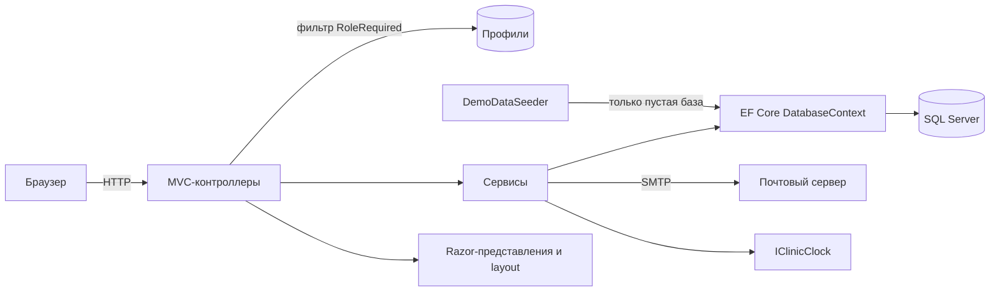
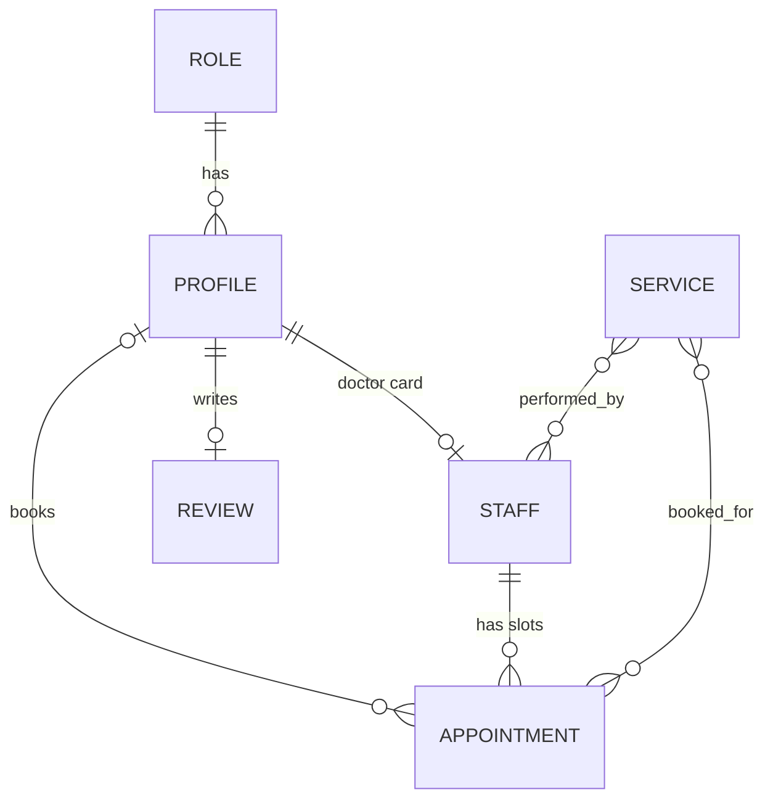

# Аврора Дент

> [🇬🇧 English](README.md) | 🇷🇺 Русский | [🇫🇷 Français](README.fr.md) | [🇩🇪 Deutsch](README.de.md)

[](https://github.com/DogNellaf/aurora-dent/actions/workflows/ci.yml)


Веб-приложение стоматологической клиники. Публичный сайт предлагает онлайн-запись,
а отдельные кабинеты обслуживают пациентов, врачей, менеджеров и администраторов.
Данные хранятся в SQL Server, пустая база заполняется демо-клиникой при первом
запуске. Интерфейс доступен на русском, английском, французском и немецком языках. Клиника, врачи и отзывы вымышлены,
фотографии взяты с [Unsplash](https://unsplash.com).


## Быстрый старт

Docker Compose запускает приложение вместе с SQL Server и почтовым стендом.

```bash
docker compose up --build
```

Открыть <http://localhost:8080>. На странице входа есть кнопки быстрого входа в
демо-аккаунты, пароль у всех `Demo123!`. Все письма приложения (подтверждения
записи с файлом календаря, сброс пароля) появляются на <http://localhost:8025>.

| Роль | Email | Возможности |
|---|---|---|
| Пациент | `client@clinic.demo` | Запись и отмена визитов, рекомендации, отзыв |
| Врач | `doctor@clinic.demo` | Дашборд текущего приёма, продление и досрочное завершение, карта пациента |
| Менеджер | `manager@clinic.demo` | Очередь модерации отзывов |
| Администратор | `admin@clinic.demo` | Обзор клиники, расписание, профили, отзывы |

Для разработки на локальной машине достаточно поднять только базу и запустить
приложение.

```bash
docker compose up -d db
dotnet run
```

Приложение слушает <http://localhost:5000>. Готовый образ публикуется в GitHub
Container Registry из CI.

```bash
docker run -p 8080:8080 -e ConnectionStrings__DefaultConnection="..." ghcr.io/dognellaf/aurora-dent:latest
```

## Кейс

### Задача

Небольшой клинике нужно единое место, где пациенты видят свободное время и
записываются без звонка, врачи ведут день, включая идущий приём, менеджеры
контролируют публикацию отзывов, а администраторы занимаются остальным. Два
пациента не должны оказаться на одном времени, а каждая роль должна видеть
только нужные данные.

### Решение

| Роль | Кабинет |
|---|---|
| **Пациент** | Предстоящие визиты и история с рекомендациями врача, отмена не позднее чем за 2 часа, файл календаря для каждого визита, один отзыв с модерацией, собственный профиль и пароль |
| **Врач** | Текущий приём с индикатором прогресса, расписание на день, продление или досрочное завершение с причиной, рекомендации, история пациента, генератор собственных свободных окон |
| **Менеджер** | Отзывы на модерации и опубликованные со счётчиком, действия публикации и скрытия |
| **Администратор** | Счётчики и ближайшие записи, CRUD и массовое создание окон расписания, профилей (создание, правка, блокировка, удаление) и отзывов, поиск и страницы во всех списках |

Запись проходит тремя шагами на одной странице, с необязательной услугой, врачом,
отфильтрованным по услуге, и свободным временем. Свободное время видно всем,
записаться могут только пациенты.

### Инженерные решения

- **Одно окно нельзя занять дважды.** Запись выполняется одним запросом
  `UPDATE ... WHERE Id = @id AND ClientId = 0` (`ExecuteUpdate`). Из двух
  одновременных запросов строку изменяет только один, другой получает сообщение,
  что время только что заняли. Интеграционные тесты проверяют гонку двух
  пациентов.
- **Авторизация в одном месте.** Фильтр `[RoleRequired]` один раз за запрос
  находит профиль, проверяет роль и разлогинивает аккаунты, заблокированные или
  удалённые при ещё действующем cookie. Анонимные пользователи попадают на
  страницу входа, пользователи с другой ролью на страницу отказа в доступе.
  Тесты проверяют каждую роль против каждого кабинета.
- **Миграции и тест на расхождение.** Схема создаётся миграциями EF Core при
  запуске, а четыре роли входят в модель (`HasData`), поэтому свежая база сразу
  пригодна к работе. Тест сравнивает модель с последним снимком миграций и
  падает, если изменение модели пришло без миграции.
- **Правила на стороне базы.** Внешний ключ от визита к пациенту (у свободного
  окна пациента нет, вместо магического нуля), уникальный индекс по врачу и
  времени начала, один отзыв на пациента, точные цены `decimal`. Тесты
  доказывают, что база отвергает нарушения, поэтому правила действуют даже в
  обход кода приложения.
- **Часовой пояс клиники.** Время визитов хранится по местному времени клиники.
  `IClinicClock` построен на `TimeProvider` и настроенной зоне IANA, поэтому
  контейнеры в UTC не сдвигают расписание, а часы подменяются в тестах.
- **Слой сервисов.** Запись, создание расписания, профили, отзывы, уведомления
  и экспорт календаря живут в сервисах за интерфейсами. Контроллеры только
  переводят HTTP в вызовы сервисов, а результаты в ответы.
- **Сбои почты остаются локальными.** Запись и отмена отправляют письма по
  SMTP (MailKit) с вложением `.ics`. Сбой почтового сервера пишется в лог и
  игнорируется, что подтверждает тест. Без SMTP-хоста отправитель только
  пишет в лог.
- **Структурное логирование.** Serilog пишет события с именованными свойствами,
  например идентификаторами профиля и приёма, включено логирование запросов.
- **Идемпотентные демо-данные.** Сидер срабатывает только на пустой базе и строит
  расписание относительно текущей даты, включая идущий приём, поэтому дашборд
  врача никогда не пустой.
- **Согласованное удаление.** Удаление профиля освобождает будущие окна пациента
  и удаляет отзывы. Освобождённое окно не хранит ничего от прежнего визита, ни
  рекомендаций, ни услуг. Врача с пациентами удалить нельзя, потому что внешние
  ключи убрали бы визиты других людей, вместо этого профиль блокируется. Врач
  без пациентов удаляется вместе с карточкой и расписанием. Создание
  врача создаёт и карточку, поэтому кабинет работает сразу.
- **Эксплуатация из коробки.** Эндпоинт `/health` проверяет базу, на нём
  построен Docker health check. Каждый ответ содержит заголовки безопасности
  (Content Security Policy без inline-скриптов, `X-Frame-Options`, `nosniff`,
  политики referrer и permissions). Статика с версиями кэшируется надолго.
  Подключения к базе повторяются, пока сервер запускается.
- **Четыре языка.** Интерфейс, сообщения проверки, письма и файлы календаря
  доступны на русском, английском, французском и немецком языках, язык выбирается
  переключателем или настройкой браузера. Таблицы переводов встроены в сборку как
  JSON, а тесты падают при отсутствии перевода, изменённом плейсхолдере или
  русском тексте на странице другого языка.
- **Без клиентского фреймворка.** Дизайн-система на чистом CSS с токенами в одном
  файле стилей, около 100 строк обычного JS, SVG-спрайт иконок и шрифты в
  проекте. Кириллица и латиница с диакритикой отдаются как есть, без сущностей `&#x...;`.
- **Доступность и адаптивность.** Семантическая разметка, видимый фокус,
  поддержка `prefers-reduced-motion`, мобильное меню, вёрстка проверена на 390 px.

### Безопасность

- Каждый POST несёт antiforgery-токен (`AutoValidateAntiforgeryToken`). Выход и
  запись работают только через POST, поэтому ссылка или картинка не запускают
  действие.
- Заблокированные аккаунты не входят и разлогиниваются при следующем запросе.
  Блокировка хранится отдельным столбцом, поэтому правка профиля оставляет блокировку без изменений.
- Ссылки в письмах строятся от настроенного публичного адреса, поэтому
  подделанный заголовок Host не перенаправит ссылку сброса пароля на другой сайт.
- Пять неверных паролей блокируют аккаунт на пятнадцать минут, сброс пароля
  снимает блокировку.
- Ссылки сброса пароля одноразовые. Форма сброса отвечает одинаково для
  известных и неизвестных адресов, поэтому зарегистрированные email нельзя
  узнать перебором.
- Пациенты открывают и отменяют только собственные визиты, остальное возвращает
  404. Врачи работают только с приёмами, назначенными врачу.
- `returnUrl` после входа принимается только локальный.
- Ввод проверяется на сервере, сообщения на языке посетителя. Правка профиля привязывает
  явные view-модели вместо сущностей.
- Content Security Policy запрещает inline-скрипты и сторонний код. Тест
  просматривает страницы, чтобы inline-скрипт или `onclick` не проскочили.
- Пароли хэшируются средствами ASP.NET Core Identity. Демо-аккаунты используют
  общий опубликованный пароль, поэтому демо-данные по умолчанию выключены и
  включаются только настройками разработки и файлом Compose.
- Сообщение о блокировке появляется только после верного пароля, заблокированный
  аккаунт на публичных страницах считается вышедшим, а заблокированный врач
  исчезает с сайта и недоступен для записи.
- Заголовки `X-Forwarded-*` принимаются только из настроенных сетей прокси (по
  умолчанию частные диапазоны). Врач открывает карту своих пациентов, а не любых.

### Архитектура



Модель данных.



| Модуль | Ответственность |
|---|---|
| `Controllers/HomeController.cs` | Публичные страницы, просмотр расписания и атомарная запись |
| `Controllers/{Auth,Account,Client,Doctor,Manager,Admin}Controller.cs` | Вход и сброс пароля, собственный профиль и по контроллеру на роль с защитой `[RoleRequired]` |
| `Services/BookingService.cs` | Атомарная запись и отмена с окном отмены |
| `Services/ScheduleService.cs` | Данные страницы записи и массовое создание окон |
| `Services/ProfileService.cs`, `Services/ReviewService.cs` | Правила профилей и отзывов с согласованной очисткой |
| `Services/Notifier.cs`, `Services/Email.cs`, `Services/CalendarExporter.cs` | Письма, доставка по SMTP и файлы `.ics` |
| `Services/ClinicClock.cs` | Текущее время в часовом поясе клиники |
| `Infrastructure/RoleRequiredAttribute.cs` | Аутентификация, проверка роли и блокировки |
| `Infrastructure/SecurityHeaders.cs` | CSP и другие заголовки безопасности |
| `Infrastructure/Fmt.cs` | Деньги, даты, длительности и формы множественного числа на языке посетителя |
| `Localization/` | Список языков, встроенные таблицы переводов и локализатор для представлений, проверки и писем |
| `Data/DemoDataSeeder.cs` | Демо-клиника с услугами, врачами, расписанием, пациентами и отзывами |
| `Data/Migrations/` | Миграции EF Core |
| `Models/ViewModels/` | Модели для представлений, чтобы представления не делали лишних запросов |
| `Views/Shared/_CabinetLayout.cshtml` | Общий layout четырёх кабинетов |

## Языки

Интерфейс, сообщения проверки и письма доступны на русском, английском,
французском и немецком языках. Русский остаётся исходным языком и языком по
умолчанию. Язык берётся из cookie, которую ставит переключатель в верхней
панели, затем из заголовка `Accept-Language` браузера. Тексты ищутся по русской
формулировке в `Localization/Resources/{en,fr,de}.json`, поэтому текст без
перевода, например услуга, введённая менеджером, показывается как есть. Даты,
числа, формы множественного числа и длительности тоже следуют языку.

Добавление языка занимает три шага. Язык вносится в `Localization/Languages.cs`,
таблица `Localization/Resources/<код>.json` получает те же ключи, что и
`en.json`, а `Infrastructure/Fmt.cs` получает правила форматирования, если язык
в них нуждается.

## Скриншоты

| Онлайн-запись | Кабинет пациента |
|---|---|
|  |  |

| Кабинет врача | Обзор администратора |
|---|---|
|  |  |

| Услуги | Модерация отзывов |
|---|---|
|  |  |

| Генератор расписания | Приёмы у администратора |
|---|---|
|  |  |

| Главная на телефоне | Запись на телефоне |
|---|---|
|  |  |

## Конфигурация

Настройки берутся из `appsettings.json` или переменных окружения, например
`ConnectionStrings__DefaultConnection`.

| Ключ | Назначение | По умолчанию |
|---|---|---|
| `ConnectionStrings:DefaultConnection` | Строка подключения к SQL Server | `localhost,1433`, база `dental_clinic`, сервис `db` из `docker-compose.yml` |
| `Seed:DemoData` | Заполнение пустой базы демо-данными, включено в Development и в `docker-compose.yml` | `false` |
| `Bootstrap:AdminEmail`, `Bootstrap:AdminPassword`, `Bootstrap:AdminName` | Создаёт первого администратора при отсутствии администраторов | пусто |
| `Hosting:TrustedProxies` | Сети в формате CIDR, чьим заголовкам `X-Forwarded-*` верят | loopback и частные диапазоны |
| `Hosting:HttpsRedirection` | Перенаправление HTTP на HTTPS, выключено, так как TLS обычно завершает прокси | `false` |
| `Clinic:TimeZone` | Часовой пояс клиники по IANA, по нему считается время всех визитов | `Europe/Moscow` |
| `Clinic:PublicUrl` | Публичный адрес сайта, по нему строятся ссылки в письмах вместо заголовка Host запроса | пусто, берётся из запроса |
| `Clinic:Name`, `Clinic:Address`, `Clinic:Phone` | Данные для писем и файлов календаря | демо-клиника |
| `Email:Host`, `Email:Port`, `Email:UseSsl`, `Email:User`, `Email:Password`, `Email:FromAddress` | SMTP-сервер, пустой хост означает, что письма только пишутся в лог | пусто |

Боевое развёртывание оставляет демо-данные выключенными и один раз задаёт
`Bootstrap__AdminEmail` и `Bootstrap__AdminPassword`, после чего первый
администратор создаётся при запуске. Идентификаторы ролей 1 клиент,
2 администратор, 3 менеджер и 4 доктор.

### Миграции

Миграции применяются автоматически при запуске. База с таблицами, но без
истории миграций, осталась от старой версии приложения, и запуск останавливается
с пояснением. Такую базу нужно удалить. Новая миграция создаётся локальным
инструментом EF.

```bash
dotnet tool restore
dotnet ef migrations add AddSomething --project DentalClinic.csproj -o Data/Migrations
```

## Тесты

Тестам нужен SQL Server. Сервис `db` из Compose предоставляет такой сервер.

```bash
docker compose up -d db
dotnet test
```

Всего 242 теста, покрытие строк 97%. Большинство интеграционные, с запуском
всего приложения на свежей базе и используют настоящие HTTP-запросы, cookie и
antiforgery-токены. Покрыты публичные страницы, доступ для каждой роли,
регистрация, вход и блокировки, запись с гонкой за одно окно, отмена, управление
приёмом у врача, правила очистки у администратора, модерация отзывов,
блокировка входа, сброс пароля, письма, массовое создание окон, поиск и
страницы, ограничения базы, заголовки безопасности и health check. Тесты локализации проверяют каждую страницу каждого кабинета на всех языках. Остальные
тесты проверяют сервисы, часы клиники, экспорт календаря и форматирование. Каждый
тестовый класс создаёт отдельную базу и удаляет базу после завершения. Другой
сервер выбирается переменной `TEST_SQLSERVER_CONNECTION`, строкой подключения без
имени базы.

Сквозной smoke-тест проходит пользовательский путь по HTTP на запущенном
экземпляре и проверяет health, публичные страницы, вход, запись и отмену,
скачивание календаря, блокировку входа, страницы и разделение ролей. При
заданной переменной `SMOKE_MAIL_URL` тест проверяет и то, что письмо с
подтверждением дошло до почтового сервера.

```bash
python3 docker/smoke_test.py http://localhost:8080
```

### CI

[`ci.yml`](.github/workflows/ci.yml) запускается при каждом push и pull request.

| Задача | Действие |
|---|---|
| **Format and warnings** | `dotnet format` по `.editorconfig` и сборка Release с предупреждениями как ошибками |
| **Tests with coverage** | Весь набор на контейнере SQL Server, включая тест на расхождение миграций, падение при покрытии строк ниже 85%, покрытие в summary задачи |
| **Docker** | Сборка образа, запуск стенда Compose с почтовым стендом, ожидание health check и запуск smoke-теста |

[`docker-publish.yml`](.github/workflows/docker-publish.yml) публикует образ в
GitHub Container Registry из `master` и по тегам версий. Dependabot отслеживает
пакеты NuGet, GitHub Actions и базовые образы. Локальные проверки описаны в
[CONTRIBUTING.md](CONTRIBUTING.md).

## Структура проекта

```
├── Controllers/           # Публичный сайт и по контроллеру на роль
├── Data/                  # Сидер демо-данных и миграции EF Core
├── Services/              # Запись, расписание, профили, отзывы, уведомления, часы
├── Infrastructure/        # Фильтр [RoleRequired], заголовки безопасности, страницы, форматирование
├── Localization/          # Языки и таблицы переводов (en, fr, de)
├── Models/                # Сущности EF, DTO и view-модели
├── Views/                 # Razor-представления, layout и partial
├── wwwroot/               # CSS, JS, шрифты и изображения
├── DentalClinic.Tests/    # Интеграционные и unit-тесты xUnit
├── docker/smoke_test.py   # Сквозной smoke-тест запущенного экземпляра
├── docs/screenshots/
├── Dockerfile
├── docker-compose.yml     # Приложение, SQL Server и почтовый стенд
└── .github/               # CI, публикация образа, Dependabot, шаблон PR
```

## Благодарности

Фотографии с [Unsplash](https://unsplash.com) по лицензии Unsplash. Интерьер
Benyamin Bohlouli, снимки КТ Jonathan Borba, улыбка Dr Farid Sharifi, портреты
врачей Siednji Leon, Bruno Rodrigues и Usman Yousaf. Шрифты Manrope и Playfair
Display (SIL OFL) через Fontsource.

## Лицензия

[PolyForm Noncommercial 1.0.0](LICENSE). Использование, изменение и
распространение разрешены для любых некоммерческих целей при сохранении
уведомления `Copyright (c) 2026 DogNellaf`. Коммерческое использование требует
отдельной лицензии от [DogNellaf](https://github.com/DogNellaf).
